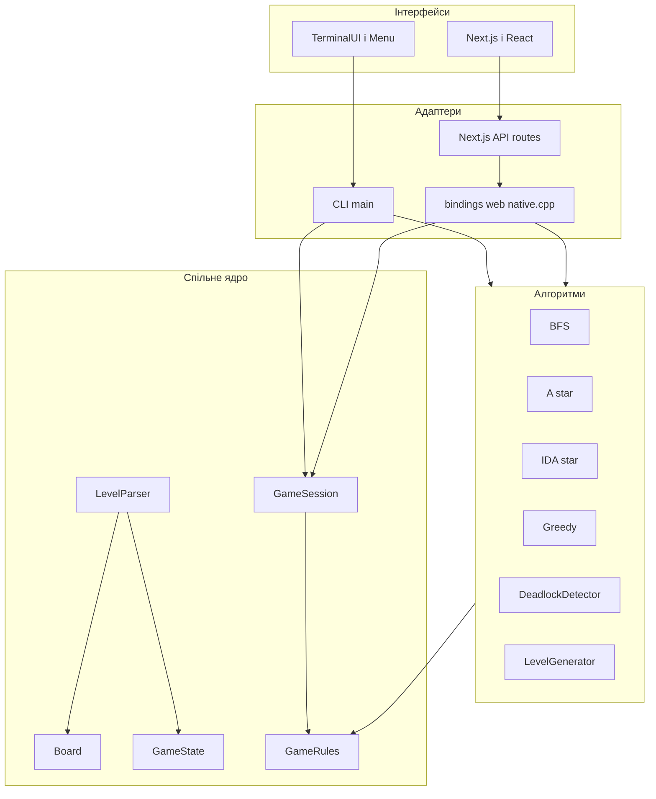
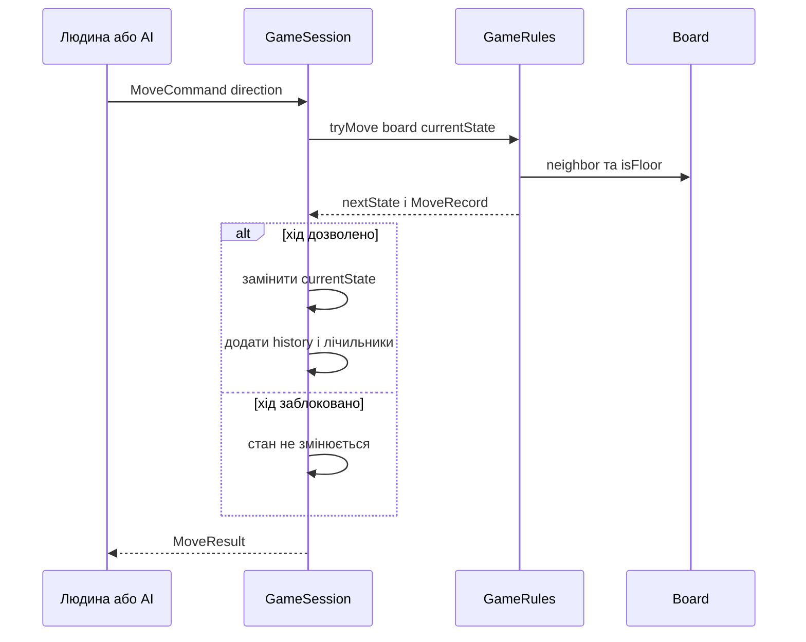

# Архітектура і модель даних SOKOBAN

## Призначення механіки

Програма розділяє незмінну геометрію рівня, поточну позицію об’єктів, правила переходу та способи взаємодії з користувачем. Завдяки цьому CLI, web, тести, локальні solver-и та зовнішній ШІ не мають власних копій правил Sokoban.

## Шари програми



## Статичне поле Board

`Board` зберігає те, що не змінюється під час гри:

- ширину й висоту;
- маску стін;
- маску підлоги;
- маску цілей і відсортований список цілей;
- чотирьох сусідів кожної клітинки;
- reverse-push відстань від кожної клітинки до кожної цілі;
- маску статичних мертвих клітинок.

Клітинка кодується одним числом `CellIndex`:

```text
index = y * width + x
x = index % width
y = index / width
```

При ширині `7` координата `(3, 2)` має індекс `2 * 7 + 3 = 17`. Це дозволяє використовувати компактні вектори замість двовимірних об’єктів.

## Динамічний стан GameState

`GameState` містить тільки:

```text
player : CellIndex
boxes  : відсортований vector<CellIndex>
```

Ящики завжди сортуються. Через це одна й та сама розстановка не залежить від того, який ящик умовно вважався «першим». Перевірка `hasBox` використовує двійковий пошук, а порівняння станів — позицію гравця і весь відсортований список ящиків.

## Команда, запис і результат

Один логічний перехід представлений трьома структурами з `Types.hpp`:

| Структура | Роль |
|---|---|
| `MoveCommand` | намір рухатися у напрямку та джерело команди |
| `MoveRecord` | точний перехід: звідки й куди пішов гравець і, за потреби, ящик |
| `MoveResult` | успіх, факт штовхання, завершення рівня та тривалість правила |

`CommandSource` має значення `Human`, `AI`, `Replay`, `Test`. Геометричні правила однакові для всіх джерел; джерело потрібне для історії та керування Redo.

## Потік однієї команди



## Чому solver не змінює GameSession

Пошукові алгоритми працюють із копіями `GameState`. Це ізолює перебір тисяч позицій від реальної партії. Коли solver повертає маршрут, `ReplayValidator` повторно проганяє його через `GameRules`. Лише після цього UI може запропонувати відтворення.

## Приклад наскрізного потоку

Для рівня:

```text
#####
#@$.#
#####
```

1. `LevelParser` додає зовнішню рамку й створює `Board` та початковий `GameState`.
2. Команда `R` надходить у `GameSession::apply`.
3. `GameRules::tryMove` бачить ящик праворуч від гравця і вільну ціль за ящиком.
4. Новий стан має гравця на старій позиції ящика, а ящик — на цілі.
5. `GameState::isGoal` повертає `true`.
6. Історія отримує `MoveRecord`, а лічильники стають `moves = 1`, `pushes = 1`.

## Основні файли

- `src/core/Types.hpp`
- `src/core/Board.hpp` і `Board.cpp`
- `src/core/GameState.hpp` і `GameState.cpp`
- `src/core/GameRules.hpp` і `GameRules.cpp`
- `src/core/GameSession.hpp` і `GameSession.cpp`
