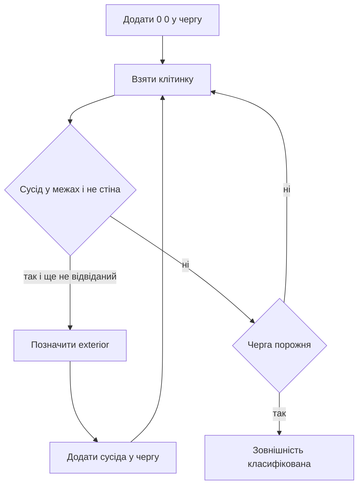

# Парсер рівнів XSB

## Що робить парсер

`LevelParser` перетворює текстову карту на безпечний `Board` і початковий `GameState`. Окрім читання символів, він відрізняє внутрішню підлогу від пробілів за межами кімнати та відхиляє структурно неправильні рівні.

## Алфавіт XSB

| Символ | Статичний шар | Динамічний шар |
|---|---|---|
| `#` | стіна | нічого |
| ` ` | потенційна підлога або зовнішність | нічого |
| `.` | ціль | нічого |
| `$` | підлога | ящик |
| `*` | ціль | ящик |
| `@` | підлога | гравець |
| `+` | ціль | гравець |

Рядки, що починаються з `;` або `'`, трактуються як метадані. Перший придатний текст може стати назвою рівня. Парсер читає лише одну карту: після початку карти перший рядок без XSB-ознак завершує її.

## Етап 1. Нормалізація прямокутника

Рядки XSB можуть мати різну довжину. Парсер знаходить найбільшу ширину, доповнює коротші рядки пробілами й додає навколо карти рамку товщиною одну клітинку.

```text
Вхід:            Внутрішня сітка парсера:
#####            ·······
#@$.#            ·#####·
#####            ·#@$.#·
                 ·#####·
                 ·······
```

Крапка `·` на правій схемі означає службовий пробіл, а не XSB-ціль. Через рамку клітинка `(0, 0)` гарантовано розташована зовні.

## Етап 2. Flood fill зовнішнього простору

Черга BFS починається в `(0, 0)` і проходить через усі клітинки, які не є стінами. Усі досяжні пробіли позначаються як зовнішність.



Якщо вода ззовні може дістатися `@`, `$`, `.`, `*` або `+`, відповідний об’єкт лежить у незамкненому просторі. Для гравця, ящика чи цілі парсер кидає виняток.

## Етап 3. Семантична перевірка

Парсер вимагає:

- рівно одного гравця;
- принаймні один ящик;
- однакову кількість ящиків і цілей;
- лише дозволені символи;
- відсутність значущих об’єктів у зовнішньому просторі.

### Приклад помилки кількості

```text
######
#@$$.#
######
```

Тут два ящики й одна ціль. Парсер завершується повідомленням про невідповідність `box count` і `goal count`; solver навіть не запускається.

### Приклад витоку назовні

```text
#####
  @$.#
#####
```

Ліва межа відкрита. Flood fill доходить до гравця, тому рівень відхиляється як `player is in exterior unbounded space`.

## Етап 4. Побудова Board

Після flood fill:

- `#` стає стіною;
- будь-яка не зовнішня й не стінова клітинка стає підлогою;
- `.`, `*`, `+` додатково стають цілями;
- координати `@` або `+` стають позицією гравця;
- координати `$` або `*` стають ящиками.

Потім викликається `board.finalize()`. Саме там обчислюються сусіди, reverse-push відстані й dead squares.

## Важливий наслідок рамки

Розмір `Board` на дві клітинки більший за видиму XSB-карту в кожному вимірі. Web-компонент `BoardView` навмисно віднімає цю рамку та додає зсув `+1`, коли перетворює видимі координати назад на `CellIndex`.

## Складність

Нехай `W * H` — розмір доповненої сітки.

- читання і валідація символів: `O(W * H)`;
- flood fill: `O(W * H)` часу й `O(W * H)` пам’яті;
- побудова масок: `O(W * H)`;
- `finalize()` має додаткову вартість reverse-push BFS, описану окремо.

## Основні файли і тести

- реалізація: `src/core/LevelParser.cpp`;
- структура результату: `src/core/LevelParser.hpp`;
- перевірки: `tests/test_parser.cpp`;
- web-обмеження власного XSB: `web/src/app/api/game/route.ts`.
