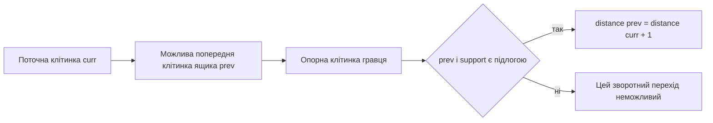

# Попередня обробка поля

## Навіщо вона потрібна

Після парсингу `Board::finalize` один раз готує дані, які багаторазово використовують правила й solver-и. Це переносить повторювану роботу з гарячого циклу пошуку в одноразову підготовку рівня.

## Крок 1. Список цілей

Усі індекси з `goalsMask` копіюються у `goals_` і сортуються. Номер цілі в цьому масиві стає номером рядка у таблиці reverse-push відстаней.

## Крок 2. Таблиця сусідів

Для кожної підлогової клітинки зберігаються чотири сусіди в порядку:

```text
0 = Up, 1 = Left, 2 = Down, 3 = Right
```

Якщо сусід поза картою або не є підлогою, записується `INVALID_CELL`. Тому під час гри `board.neighbor(cell, dir)` не обчислює координати заново.

```text
      U
      |
L --- C --- R
      |
      D
```

## Крок 3. Reverse push BFS

Для кожної цілі запускається окремий BFS назад. Він відповідає на питання:

> Якби інших ящиків не існувало, скільки штовхань потрібно, щоб доставити ящик із клітинки `c` на цю ціль?

Розглянемо пряме штовхання праворуч:

```text
до:    @ $ _
після: _ @ $
```

Якщо в прямому напрямку ящик переходить з `prev` у `curr`, гравець перед штовханням мусить стояти ще на одну клітинку позаду `prev`. Зворотний BFS тому перевіряє одразу дві клітинки:

```text
player support <- previous box <- current reverse cell
```



Рухомих ящиків і поточної позиції гравця тут немає. Обчислення враховує лише статичну геометрію стін і підлоги.

## Приклад reverse-push відстані

```text
#######
#  .  #
#     #
#     #
#######
```

Для центральної цілі клітинки прямо під нею отримують відстані `1`, `2` тощо, якщо за кожною позицією є місце для гравця. Клітинка біля нижньої стіни може мати `INF`, навіть коли її мангеттенська відстань мала: гравець не зможе стати позаду ящика для останнього штовхання.

## Крок 4. Мінімальна відстань і dead square

Для кожної клітинки береться мінімум відстаней до всіх цілей. Якщо жодна ціль недосяжна в reverse-push моделі, значення дорівнює `INF_DISTANCE`.

Підлогова клітинка стає статично мертвою, якщо:

```text
клітинка не є ціллю
і minReversePushDistance == INF_DISTANCE
```

Ящик на такій клітинці ніколи не потрапить на жодну ціль навіть у спрощеному світі без інших ящиків. Це безпечна причина відсікти стан.

## Використання результатів

| Дані | Споживач |
|---|---|
| `neighbors_` | `GameRules`, усі BFS доступності |
| `reversePushDistances_` | евристика A*, IDA*, Greedy, assignment deadlock |
| `minReversePushDistances_` | діагностика і dead-square класифікація |
| `deadSquares_` | `DeadlockDetector::hasStaticDeadSquare` |

## Складність

Нехай `V = W * H`, а `K` — кількість цілей.

- сусіди: `O(V)` часу і `O(V)` пам’яті;
- один reverse BFS: `O(V)`;
- усі reverse BFS: `O(K * V)` часу і `O(K * V)` пам’яті;
- побудова мінімумів: `O(K * V)`.

## Межа моделі

Кінцева reverse-push відстань не гарантує, що ящик реально можна доставити до цілі у поточному стані: інші ящики можуть перекрити шлях. Значення є нижньою оцінкою та статичним тестом неможливості, а не повним solver-ом.

## Основний файл

`src/core/Board.cpp`, функції `computeNeighbors` і `computeReversePushDistances`.
