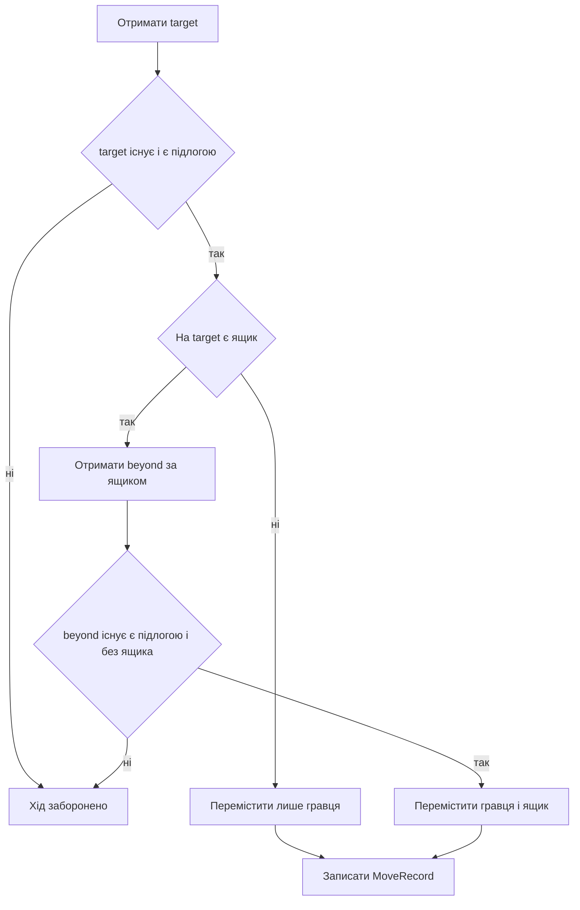

# Правила руху і штовхання

## Єдина точка істини

`GameRules` визначає всі легальні переходи. Ручна гра, BFS, replay і тести використовують одну функцію `tryMove`, тому solver не може легально зробити те, чого не може гравець.

## Алгоритм одного руху

Нехай `p` — позиція гравця, `target` — сусід у заданому напрямку.



## Простий крок

```text
до:    @ _
після: _ @
```

У новому стані змінюється тільки `player`. Поля `boxFrom` і `boxTo` в `MoveRecord` дорівнюють `INVALID_CELL`, тому `pushedBox()` повертає `false`.

## Штовхання

```text
до:    @ $ _
після: _ @ $
```

Штовхання дозволене лише тоді, коли:

1. сусідня клітинка містить ящик;
2. клітинка за ящиком існує;
3. вона є підлогою;
4. на ній немає іншого ящика.

Ящик пересувається методом `GameState::moveBox`, після чого список ящиків знову сортується.

## Заборонені ситуації

### Стіна

```text
@ #    -> заборонено
```

### Два ящики

```text
@ $ $  -> заборонено
```

### Ящик перед стіною

```text
@ $ #  -> заборонено
```

Гра не підтримує підтягування ящика, діагональні переходи чи одночасне штовхання кількох ящиків.

## Перемога

`GameState::isGoal` перевіряє кожен ящик. Стан виграшний, якщо кожен ящик стоїть на цілі. Парсер гарантує однакову кількість ящиків і цілей, тому це також означає заповнення всіх цілей.

```text
for each box:
    if box is not on goal:
        return false
return true
```

## MoveRecord і скасування

Для простого кроку записуються `playerFrom`, `playerTo`, напрямок і джерело. Для штовхання додатково записуються `boxFrom` і `boxTo`.

`undoRecord` виконує зворотний перехід:

```text
playerTo -> playerFrom
boxTo    -> boxFrom, якщо був ящик
```

Перед скасуванням перевіряється, що гравець справді стоїть у `playerTo`; для штовхання також перевіряється наявність ящика у `boxTo`.

## `canMove` і `tryMove`

`canMove` лише відповідає `true/false`. `tryMove` повторює ті самі геометричні перевірки, але ще створює новий стан і `MoveRecord`. Основний код гри та solver-и використовують `tryMove`, бо їм потрібен результат переходу.

## Складність

Перевірка сусіда — `O(1)`. Пошук ящика — `O(log K)` завдяки відсортованому вектору. Під час реального штовхання `moveBox` після заміни повторно сортує `K` позицій, тому верхня межа переходу — `O(K log K)`. Простий крок копіює стан і вектор ящиків, отже також має вартість `O(K)` через копіювання.

## Основні файли і тести

- `src/core/GameRules.cpp`;
- `src/core/GameState.cpp`;
- `tests/test_rules.cpp`.
