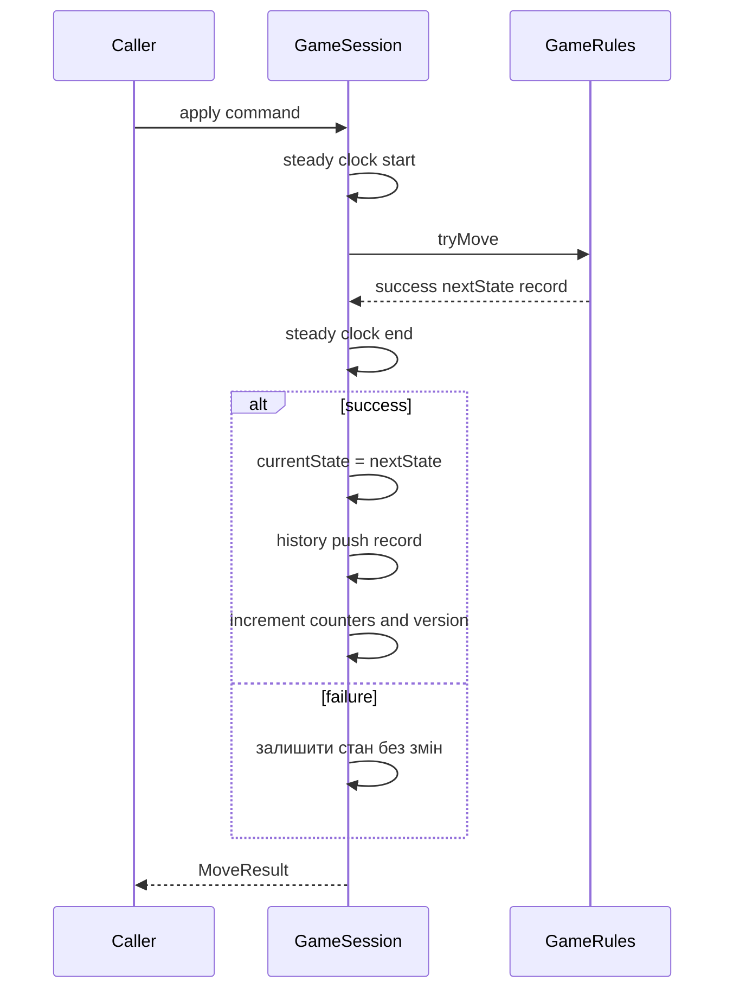

# Сесія гри Undo Redo і Restart

## Роль GameSession

`GameSession` володіє полем, початковим станом, поточним станом, історією та лічильниками. Вона не вирішує рівень і не малює UI; її завдання — послідовно застосовувати команди через `GameRules`.

## Збережений стан сесії

| Поле | Значення |
|---|---|
| `board_` | незмінне поле |
| `initialState_` | позиція після завантаження рівня |
| `currentState_` | актуальна позиція |
| `history_` | виконані `MoveRecord` |
| `redoStack_` | скасовані записи |
| `moveCount_` | кількість успішних рухів у поточній історії |
| `pushCount_` | кількість штовхань |
| `stateVersion_` | номер зміни стану |

## Apply



`logicalMoveDuration` вимірює тільки виклик правил і не включає рендеринг, очікування вводу чи анімацію.

## Undo

1. Взяти останній запис з `history_`.
2. Викликати `GameRules::undoRecord`.
3. Перемістити запис у `redoStack_`.
4. Зменшити `moveCount_` і, якщо треба, `pushCount_`.
5. Збільшити `stateVersion_`.

```text
history:   A B C       undo       A B
redo:      порожньо    ---->      C
```

## Redo

`redo` бере верхній запис, перетворює його назад у `MoveCommand` і викликає звичайний `apply`. Це важливо: повторення знову проходить актуальні правила, а не просто копіює готовий стан.

```text
history:   A B         redo       A B C
redo:      C           ---->      порожньо
```

## Очищення Redo після нової гілки

Якщо після Undo людина робить новий рух, старе майбутнє більше не відповідає поточній партії. `apply` очищає `redoStack_` для команд із джерелом `Human`.

```text
було: A B C
undo: A B, redo = C
новий D: A B D, redo = порожньо
```

## Restart

`restart`:

- відновлює `initialState_`;
- очищає обидві історії;
- обнуляє рухи й штовхання;
- збільшує версію стану.

Поле не парситься повторно, бо `Board` незмінний.

## State version

Версія збільшується після успішного Apply, Undo, Redo через Apply і Restart. Це простий монотонний індикатор зміни позиції, придатний для скасування застарілих асинхронних результатів. Поточні CLI й web переважно використовують власні механізми invalidation, але API вже є.

## Важливий нюанс поточної реалізації

`redo()` відтворює оригінальне джерело команди. Якщо це `Human`, внутрішній `apply()` очищає весь залишок `redoStack_`. Тому один Redo працює й покритий тестами, але після кількох послідовних Undo повторення першого людського запису може видалити інші записи Redo. Web-клієнт не використовує цей стек: він перебудовує стан із рядка історії на сервері.

## Тести

`tests/test_undo_redo.cpp` перевіряє:

- простий рух Undo/Redo;
- штовхання Undo/Redo;
- очищення Redo після нового людського руху;
- Restart.
