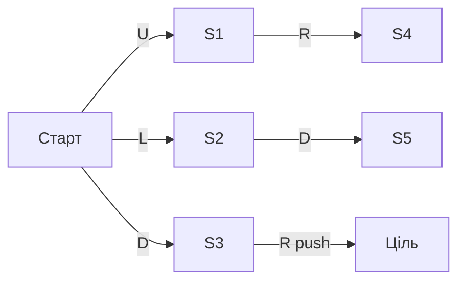

# Алгоритм BFS

## Що оптимізує BFS у цьому проєкті

`BFSSolver` розглядає кожен легальний крок гравця як ребро вартості `1`. Тому перший знайдений виграшний стан має мінімальну кількість усіх рухів, а не обов’язково мінімальну кількість штовхань.

## Граф станів

Вершина — повний `GameState`:

```text
(позиція гравця, відсортовані позиції всіх ящиків)
```

Ребро — одна успішна команда `U`, `L`, `D` або `R`, перевірена `GameRules::tryMove`.



BFS спочатку обробить усі стани глибини `0`, потім `1`, потім `2`. Якщо `G` вийнятий із черги на глибині `2`, коротшого маршруту не існує.

## Структури даних

| Структура | Призначення |
|---|---|
| `deque<uint32_t> queue_` | FIFO-черга індексів вузлів |
| `vector<BFSNode> nodes_` | усі прийняті вузли та parent links |
| `unordered_map<GameState, uint32_t> visited_` | відсікання повторних станів |

`BFSNode` зберігає стан, індекс батька, останній напрямок, глибину й ознаку штовхання.

## Ініціалізація

`start` виконує такі перевірки:

1. очищає попередній пошук і статистику;
2. якщо старт уже виграшний — повертає порожнє рішення;
3. якщо старт доведено тупиковим — повертає `NoSolution`;
4. додає корінь у `nodes_`, `queue_` і `visited_`;
5. встановлює статус `Running` і запускає `steady_clock`.

## Один цикл advance

```text
поки budget > 0 і queue не порожня:
    перевірити cancel, time, node, memory limits
    curr = queue.front; pop_front
    exploredStates++
    якщо curr виграшний: відновити рішення
    для dir у U, L, D, R:
        якщо tryMove дозволив перехід:
            generatedStates++
            якщо нове штовхання створило deadlock: відкинути
            якщо state уже visited: відкинути
            інакше зберегти node та push_back у queue
    budget--
```

Фіксований порядок `U, L, D, R` робить результат детермінованим за однакових даних і версії контейнерів.

## Приклад пошуку

```text
#####
# . #
# $ #
# @ #
#####
```

Перший хід `U` одразу штовхає ящик на ціль. Черга спочатку містить старт. Після розкриття старту створюється дочірній вузол глибини `1`. Коли він виходить із черги, `isGoal` спрацьовує, і рішення дорівнює `U`.

## Відновлення шляху

Від цільового вузла алгоритм іде за `parentIndex` до кореня:

```text
Goal --parent--> N2 --parent--> N1 --parent--> Start
```

Напрямки накопичуються у зворотному порядку, потім `std::reverse` перетворює їх на маршрут від старту. Паралельно рахується кількість вузлів із `pushed = true`.

## Перевірка рішення

Готовий шлях перед публікацією проходить `ReplayValidator`. Якщо хоча б один рух нелегальний, фінальний стан не виграшний або лічильники не збігаються, BFS повертає `InternalError`, а не неперевірене рішення.

## Deadlock pruning

Повна перевірка тупика виконується для старту. Для наступників вона запускається лише після штовхання, бо звичайний крок не змінює розстановку ящиків і не може створити новий тупик.

## Складність

Для графа з `V` досяжних станів і не більше чотирьох ребер на стан:

- час: `O(V + E)`, тут практично `O(V)`;
- пам’ять: `O(V)` для вузлів, черги й `visited`.

У Sokoban `V` експоненційно зростає з розміром поля й кількістю ящиків. Саме пам’ять зазвичай стає головним обмеженням BFS.

## Статистика

`generatedStates` рахує старт і кожен легальний перехід до перевірки дубліката. `exploredStates` рахує стани, реально вийняті з черги. `duplicatePruned` і `deadlockPruned` показують причини відсікання. `maxFrontierSize` — найбільша довжина FIFO-черги.

## Основні файли

- `src/solvers/BFSSolver.hpp`;
- `src/solvers/BFSSolver.cpp`;
- тести оптимальності: `tests/test_solvers.cpp`.
