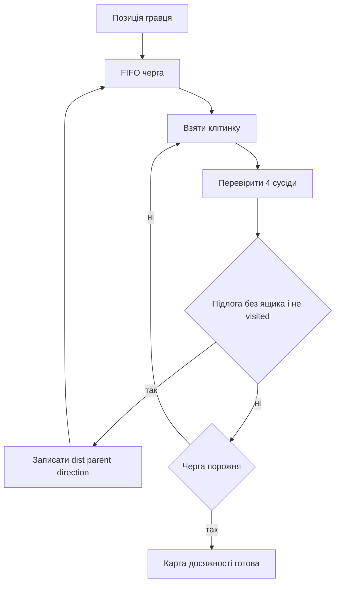

# Досяжність гравця і макроштовхання

## Навіщо потрібен другий BFS

A*, IDA* і Greedy не створюють окремий пошуковий вузол для кожного кроку гравця. Вони спочатку знаходять усі клітинки, куди гравець може дійти без пересування ящиків, а потім генерують тільки можливі штовхання.

Це стискає довгі обходи по кімнаті в одне макроребро:

```text
walk, walk, walk, push  =>  одне ребро пошукового графа
```

## BFS доступності

Вхід: конкретний `GameState`. Ящики вважаються тимчасовими стінами.

Результат містить:

- `reachable[cell]` — чи може гравець дійти до клітинки;
- `dist[cell]` — мінімальна кількість кроків;
- `parentCell[cell]` — попередня клітинка короткого маршруту;
- `moveFromParent[cell]` — напрямок переходу;
- в A* додатково `minCell` — найменший індекс доступної області.



## Умова легального штовхання

Для ящика `B` і напрямку `d` потрібні:

```text
pushSpot = сусід B у напрямку opposite(d)
boxDest  = сусід B у напрямку d
```

Штовхання існує, якщо `pushSpot` досяжний гравцем, а `boxDest` є вільною підлогою.

```text
pushSpot   box       destination
    @       $             _
    -------- push right -->
```

## Побудова фізичного наступника

Після штовхання:

- гравець опиняється на старій клітинці ящика;
- ящик опиняється в `boxDest`;
- інші ящики не змінюються.

Це справжній фізичний стан, а не тільки конфігурація ящиків.

## Відновлення макроребра

За `parentCell` алгоритм іде від `pushSpot` назад до поточної позиції гравця, розвертає список ходів і додає останнім напрямок штовхання.

```text
поточний гравець -> ...короткий шлях... -> pushSpot -> push
```

`MacroEdge.steps` тому містить повністю відтворювану послідовність звичайних команд.

## Вартість ребра

### Метрика Pushes

```text
edgeCost = 1
```

Кроки підходу безкоштовні з погляду цільової функції. Це не означає, що вони зникають із готового replay: вони зберігаються у `MacroEdge.steps`.

### Метрика Moves

```text
edgeCost = dist[pushSpot] + 1
```

Береться найкоротший підхід до ящика плюс саме штовхання.

## Приклад

```text
########
# @    #
#   $ .#
########
```

Щоб штовхнути ящик праворуч, гравець має дійти до клітинки ліворуч від ящика. Якщо короткий підхід — `D R`, макроребро дорівнює `D R R`: два кроки підходу й останній `R` як штовхання.

Для Pushes його ціна `1`, для Moves — `3`.

## Канонізація доступної області

У A* з метрикою Pushes усі позиції гравця в одній зв’язній області еквівалентні: переходити між ними можна без зміни вартості штовхань. Ключ стану замінює точну позицію гравця на `minCell` цієї області.

```text
(player = 10, boxes = B)  \
(player = 11, boxes = B)   > один канонічний стан, якщо клітинки взаємно досяжні
(player = 18, boxes = B)  /
```

Для метрики Moves канонізація не застосовується, бо різна позиція гравця змінює ціну наступного підходу.

## Складність

Один BFS доступності коштує `O(V)` часу й пам’яті для `V` клітинок. Для кожного розкритого макростану алгоритм додатково перебирає `4K` потенційних штовхань, де `K` — кількість ящиків.

## Дублювання коду

Майже однакова реалізація `computeReachability` є в A*, IDA* і Greedy. Це фактичний стан коду; окремого спільного helper поки немає.
