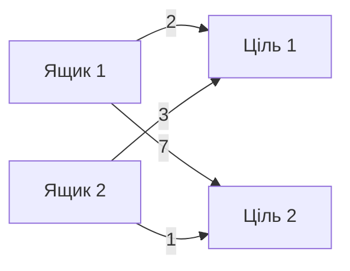

# Евристика reverse push і угорський алгоритм

## Мета евристики

A*, IDA* і Greedy мають оцінити, скільки роботи щонайменше залишилося до перемоги. Для кожного ящика відомі статичні reverse-push відстані до кожної цілі. Але не можна призначити кілька ящиків одній цілі, тому потрібне взаємно однозначне призначення.

## Матриця вартостей

Для `K` ящиків і `K` цілей будується матриця:

```text
cost[i][j] = reversePushDistance(goal j, box i)
```

Приклад:

| | Ціль G1 | Ціль G2 |
|---|---:|---:|
| Ящик B1 | 2 | 7 |
| Ящик B2 | 3 | 1 |

Є два повні призначення:

```text
B1 -> G1, B2 -> G2: 2 + 1 = 3
B1 -> G2, B2 -> G1: 7 + 3 = 10
```

Евристика вибирає `h = 3`.

## Чому не достатньо брати найближчу ціль окремо

Якщо кожен ящик незалежно обере найближчу ціль, обидва можуть обрати одну й ту саму. Така сума надто оптимістична й погано розрізняє стани. Задача мінімального паросполучення змушує кожну ціль отримати рівно один ящик.



## Угорський алгоритм у коді

`Hungarian::solve` використовує потенціали `u` і `v`, масив поточного паросполучення `p` та масив попередників `way`. Для кожного рядка він шукає найдешевший збільшуючий шлях і перебудовує matching.

Псевдокод високого рівня:

```text
for each row i:
    почати збільшуючий шлях з i
    поки не знайдено вільний стовпець:
        оновити мінімальні reduced costs
        змінити потенціали u і v
        перейти до наступного стовпця
    пройти way назад і збільшити matching
return totalCost, matching
```

Для квадратної матриці складність — `O(K^3)`, пам’ять — `O(K^2)` через саму матрицю та `O(K)` для робочих масивів.

## Нескінченна вартість

Якщо reverse-push BFS не знає шляху від ящика до цілі, ребро отримує `Hungarian::INF_COST = 1 000 000 000`. Якщо мінімальне повне призначення має вартість не меншу за цей поріг, стан вважається непридатним: принаймні одному ящику неможливо призначити окрему досяжну ціль.

## Чому оцінка допустима

Евристика ігнорує:

- взаємне блокування ящиків;
- необхідність реально провести гравця до кожної позиції;
- додаткові обходи;
- динамічні тупики.

Вона не додає роботу, а навпаки прибирає реальні обмеження. Тому сума є нижньою межею кількості штовхань. Для метрики Moves вона теж не перевищує оптимальну кількість рухів, бо кожне штовхання є рухом.

## Кешування

Результат залежить тільки від відсортованого набору позицій ящиків, тому solver-и зберігають:

```text
unordered_map<vector<CellIndex>, uint64_t, BoxConfigHasher>
```

Позиція гравця не входить у ключ. Якщо одна конфігурація ящиків зустрілася з іншого боку, повторний `O(K^3)` розрахунок не потрібен.

## Евристика і deadlock assignment

Той самий розрахунок має дві ролі:

- значення менше `INF` — евристика `h`;
- значення `INF` або більше — доведений assignment deadlock.

## Межа точності

`h = 3` не означає, що розв’язок точно потребує три штовхання. Через інші ящики реальна ціна може бути `5`, `20` або стан може бути нерозв’язним. Евристика гарантує лише нижню оцінку.

## Основні файли

- `src/solvers/Hungarian.cpp`;
- `src/core/Board.cpp`;
- `computeHeuristic` у A*, IDA* та Greedy.
