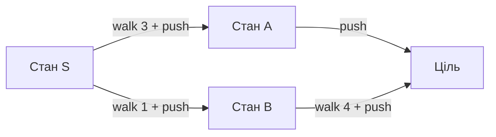
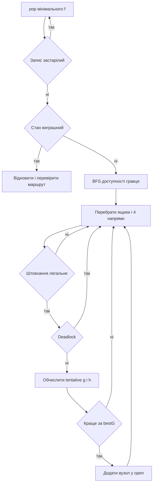

# Алгоритм A star

## Основна ідея

A* впорядковує кандидати за:

```text
f(n) = g(n) + h(n)
```

`g` — уже сплачена вартість від старту, `h` — нижня оцінка залишку через reverse-push відстані й угорське призначення.

## Пошуковий граф

На відміну від BFS, A* працює по макроштовханнях. Один вузол — фізична позиція після штовхання, а одне ребро містить короткий шлях гравця до ящика та саме штовхання.



## Дві метрики

### Мінімум штовхань

- `edgeCost = 1`;
- `g` рахує штовхання;
- позиція гравця канонізується до мінімального індексу його досяжної області;
- оптимальність стосується `pushCount`, а не повної довжини replay.

### Мінімум рухів

- `edgeCost = shortestWalkToPushSpot + 1`;
- `g` рахує всі кроки;
- точна позиція гравця залишається частиною ключа;
- за завершеного пошуку результат має мінімальний `moveCount`.

## Пріоритетна черга

`OpenEntry` містить `f`, `g`, `h`, порядковий номер і індекс вузла. Порівняння використовує:

1. найменше `f`;
2. при рівності — найменше `h`;
3. при новій рівності — раніший `seq`.

Це дає стабільну поведінку й перевагу стану, який оцінюється ближчим до цілі.

## Таблиця bestG і перевідкриття

Для кожного ключа стану зберігається найменша відома вартість `g`.

```text
новий стан відсутній        -> додати
tentative_g < bestG[state]  -> оновити і перевідкрити
tentative_g >= bestG[state] -> відкинути як дублікат
```

Коли старий дорожчий запис лишається в priority queue, він не видаляється негайно. Під час виймання `entry.g` порівнюється з актуальним `bestG`; застарілий запис збільшує `staleQueueEntries` і пропускається.

## Повний цикл розкриття



## Числовий приклад

Нехай у черзі є:

| Стан | `g` | `h` | `f` |
|---|---:|---:|---:|
| A | 2 | 4 | 6 |
| B | 5 | 2 | 7 |
| C | 1 | 6 | 7 |

A* обирає A. Потім між B і C обере B, бо за однакового `f` у B менше `h`.

## Ініціалізація

Перед додаванням кореня A*:

- приймає порожнє рішення для вже виграшного стану;
- запускає deadlock detection з assignment-перевіркою;
- обчислює `h0`;
- для Pushes створює канонічний ключ старту;
- зберігає фізичний старт у вузлі для коректного replay.

## Відновлення

Parent links повертають список `MacroEdge` від цілі до старту. Після розвороту всі `steps` склеюються в один масив напрямків. Кількість макроребер стає `pushCount`; розмір повного масиву — `moveCount`.

## Оптимальність

За умови, що пошук не скасовано й не зупинено лімітом, використана евристика є нижньою оцінкою. Реалізація допускає покращення `bestG` та пропускає stale entries, тому заявляє оптимальність відповідно до вибраної метрики.

## Складність

У найгіршому разі A* також експоненційний. Для кожного розкритого стану додаються:

- BFS доступності `O(V)`;
- до `4K` кандидатів на штовхання;
- евристика `O(K^3)` для нової конфігурації ящиків;
- операції priority queue `O(log N)`.

Пам’ять `O(N)` зберігає вузли, `open`, `bestG` і кеш евристики.

## Реалізаційний нюанс Zobrist

`start` створює об’єкт `Zobrist`, але поточний A* не викликає його під час пошуку. Реальні `bestG` і кеш евристики використовують `StateHasher` та `BoxConfigHasher`.

## Основні файли

- `src/solvers/AStarSolver.cpp`;
- `src/solvers/Hungarian.cpp`;
- `src/core/Board.cpp`.
