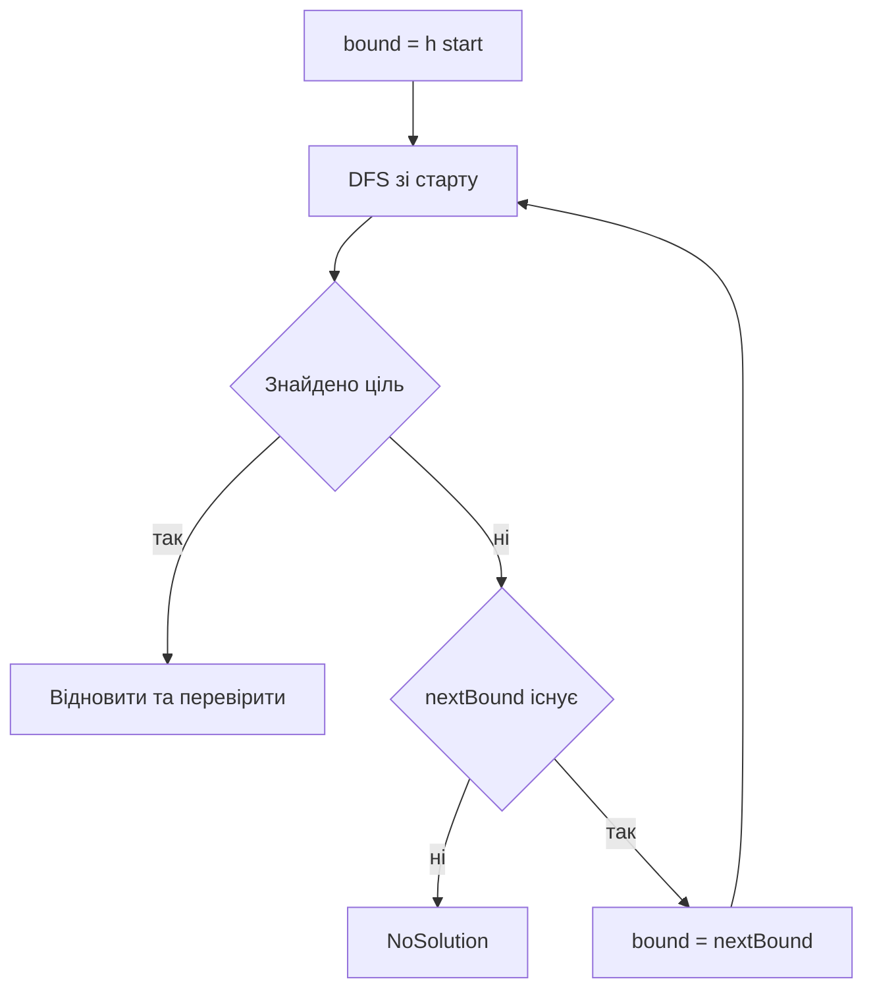

# Алгоритм IDA star

## Призначення

IDA* поєднує евристику A* з обходом у глибину. Він не зберігає широку priority queue, а багаторазово запускає DFS із дедалі більшою межею `f = g + h`.

Поточна реалізація працює по тих самих макроштовханнях і використовує ту саму Hungarian-евристику, що й A*.

## Ітеративна межа

Початкова межа:

```text
bound = h(start)
```

Під час DFS:

```text
f = g + h
if f > bound:
    nextBound = min(nextBound, f)
    повернутися з гілки
```

Коли поточна ітерація завершилася без рішення, `bound` стає `nextBound` — найменшим значенням, яке не помістилося.



## Приклад меж

Нехай `h(start) = 4`.

```text
Ітерація 1: bound 4
  A: g 1, h 3, f 4  -> дозволено
  B: g 2, h 4, f 6  -> відсічено, nextBound 6

Ітерація 2: bound 6
  B: f 6            -> дозволено
  Goal: g 6, h 0    -> рішення
```

## Генерація й порядок дітей

1. BFS знаходить доступні позиції гравця.
2. `legalPushes` будує всі макроштовхання та їх повні `steps`.
3. Для кожної дитини обчислюється `h`.
4. Діти сортуються за `h` і DFS спочатку пробує найперспективніші.

Сортування не змінює межі, але може швидше знайти рішення всередині допустимого контуру.

## Стек шляху

`path_` зберігає вибрані `PushAction`, а `stateStack_` — фізичні стани від старту до поточної вершини.

```text
stateStack: S0, S1, S2
path:          P1, P2
```

Після невдалої гілки останні елементи видаляються. Якщо знайдено ціль, `path_` уже містить прямий макромаршрут і не потребує parent links для всього дерева.

## Перевірка циклів

Перед заглибленням дитина лінійно порівнюється з кожним станом поточного `stateStack_`. Це запобігає циклу в одній гілці, але не є глобальною таблицею відвіданих станів. Той самий стан може бути повторно досліджений в іншій гілці або наступній ітерації.

## Метрики Moves і Pushes

- для Pushes ціна дії дорівнює `1`;
- для Moves — довжина короткого підходу плюс штовхання;
- `h` в обох випадках залишається нижньою оцінкою числа штовхань, а отже допустимою і для рухів.

Comparator запускає IDA* тільки в режимі Pushes, але registry і native bridge також уміють передати Moves.

## Кооперативний budget

`advance(nodeBudget)` передає budget у рекурсивний DFS. Якщо budget вичерпано, функція повертається. Поточний рекурсивний стек не серіалізується: наступний `advance` очищає шлях і повторно починає ту саму bound-ітерацію зі старту.

Наслідок:

- інтерфейс отримує контроль;
- уже досліджена частина ітерації може виконатися повторно;
- дуже малий сталий budget може створити багато повторної роботи;
- лічильник `exploredStates` усе одно зростає й зрештою може досягти node limit.

## Пам’ять

Основний пошуковий стек росте з глибиною, але повна пам’ять не є строго `O(depth)`, бо `heuristicCache_` зберігає оцінки всіх побачених конфігурацій ящиків. Реалізація оцінює пам’ять шляху, state stack і кешу.

## Оптимальність і ціна

За допустимої евристики, повного завершення ітерацій та відсутності лімітів IDA* знаходить оптимальну вартість для вибраної метрики. Плата — повторне розкриття станів при кожному збільшенні bound.

## Основні файли

- `src/solvers/IDAStarSolver.cpp`;
- тести порівняння з A* Pushes: `tests/test_solvers.cpp`.
