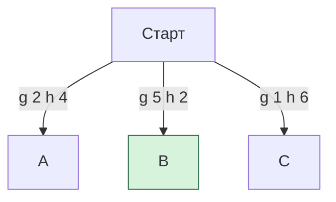

# Greedy Best First Search

## Ідея алгоритму

Greedy використовує той самий граф макроштовхань і ту саму Hungarian-евристику, що A*, але пріоритет дорівнює тільки `h`.

```text
A*:      priority = g + h
Greedy:  priority = h
```

Витрачена вартість `g` зберігається для звіту, але не впливає на порядок пошуку.

## Приклад різниці

| Стан | Уже витрачено `g` | Залишок `h` | A* `f` | Greedy |
|---|---:|---:|---:|---:|
| A | 2 | 4 | 6 | 4 |
| B | 5 | 2 | 7 | 2 |
| C | 1 | 6 | 7 | 6 |

A* обирає A, бо `6 < 7`. Greedy обирає B, бо `2` — найменше `h`, хоча шлях до B вже дорогий.



## Структури даних

- priority queue з ключем `(h, seq)`;
- `nodes_` для фізичних станів і parent links;
- `closed_` як множина повних `GameState`;
- кеш евристики за конфігурацією ящиків.

## First visit wins

Стан додається до `closed_` одразу під час генерації. Якщо пізніше до того самого фізичного стану знайдено дешевший шлях, він усе одно відкидається.

```text
перший шлях до X: g = 12 -> X потрапляє в closed
другий шлях до X: g = 7  -> відкинуто як duplicate
```

У A* така ситуація викликала б reopening. Саме відсутність reopening разом з ігноруванням `g` прибирає гарантію оптимальності.

## Поведінка пошуку

1. Перевірити старт і deadlock.
2. Обчислити `h0`.
3. Взяти з черги найменше `h`.
4. Побудувати карту доступності гравця.
5. Згенерувати макроштовхання.
6. Відкинути deadlock та вже закриті стани.
7. Обчислити `h` дитини й додати її у чергу.
8. На цілі відновити та перевірити replay.

## Що алгоритм усе ж гарантує

Якщо він повернув `Solved`, його маршрут пройшов `ReplayValidator`, отже всі команди легальні й фінальний стан виграшний. Не гарантується лише мінімальна кількість рухів або штовхань.

## Метрика в інтерфейсах

`SolverOptions.metric` записується у статистику й рішення, але внутрішній `g` Greedy завжди збільшується на одне штовхання. Registry теоретично прийме іншу метрику, однак comparator, CLI та web запускають Greedy як `Pushes`. Документувати його як оптимізатор Moves не можна.

## Складність

Найгірший випадок експоненційний. Пам’ять `O(N)` для priority queue, вузлів, `closed_` і кешу. На простих рівнях спрямований `h` може швидко привести до цілі; на складних — завести в погану область або вичерпати ліміт.

## Навчальна роль

Greedy є навмисно слабким контрастним алгоритмом. Він демонструє, чому хороша оцінка залишку сама по собі не замінює врахування вже витраченого шляху.

## Основні файли

- `src/solvers/GreedySolver.cpp`;
- порівняння: `src/cli/AlgorithmComparator.cpp`;
- web-пояснення: `web/src/components/SearchDebugger.tsx`.
