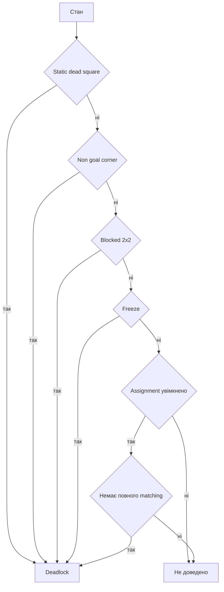

# Виявлення тупикових станів

## Що таке deadlock

Deadlock — позиція, з якої всі цілі вже не можна заповнити, навіть якщо гра ще не завершена. Відсікання таких станів не змінює правильну відповідь, але різко скорочує пошук.

`DeadlockDetector::isDeadlock` послідовно застосовує п’ять перевірок.



## 1. Статична мертва клітинка

Під час `Board::finalize` reverse-push BFS позначає клітинки, з яких ящик не може дістатися жодної цілі навіть без інших ящиків. Наявність ящика на такій нецільовій клітинці одразу доводить тупик.

```text
#####
#$  #  <- ящик уздовж стіни без досяжної цілі
# @.#
#####
```

## 2. Нецільовий кут

Для ящика не на цілі перевіряється:

```text
(стіна ліворуч або праворуч)
і
(стіна зверху або знизу)
```

```text
###
#$ 
#  
```

Ящик у такому куті неможливо витягнути. Ящик на цілі не вважається помилкою цією перевіркою.

Якщо solver передає `movedBox`, перевіряється тільки щойно пересунутий ящик. Для стартового стану можна перевірити всі ящики.

## 3. Повністю заблокований квадрат 2 на 2

Розглядаються всі блоки:

```text
[a b]
[c d]
```

Якщо кожна клітинка — стіна або ящик, блок не може змінити конфігурацію. Це deadlock, коли в ньому є хоча б один ящик не на цілі.

```text
##     $$     #$
$$ або ## або $#
```

Якщо всі ящики в заблокованому квадраті вже на цілях, ця перевірка повертає `false`.

Для `movedBox` перевіряються лише чотири квадрати 2 на 2, до яких він може належати.

## 4. Freeze deadlock

Алгоритм підтримує множину `frozen`. Для кожного ящика він визначає:

```text
blockedH = зліва заблоковано АБО справа заблоковано
blockedV = зверху заблоковано АБО знизу заблоковано
```

Блокуванням вважається межа, стіна або вже заморожений ящик. Якщо обидві осі заблоковані:

- нецільовий ящик одразу доводить deadlock;
- ящик на цілі додається у `frozen` і може заблокувати сусіда;
- цикл повторюється, доки множина не перестає змінюватися.

Це консервативна перевірка ланцюгів із ящиків на цілях. Вона не намагається розпізнати кожну можливу взаємну блокаду.

## 5. Assignment deadlock

Будується матриця reverse-push відстаней від кожного ящика до кожної цілі. Угорський алгоритм шукає повне взаємно однозначне призначення. Якщо його скінченна вартість не існує, хоча б один ящик неможливо зіставити з окремою досяжною ціллю.

```text
Ящик A може лише до Goal 1
Ящик B може лише до Goal 1
Goal 2 недосяжна обом
=> повного matching немає
```

Ця перевірка дорожча за локальні, тому виконується на старті A*/IDA*/Greedy з параметром `true`. Для кожного наступника ці solver-и викликають стандартний `isDeadlock` без assignment; однак їхня евристика окремо відкидає `h = INF`, що фактично повторює assignment-тест для нової конфігурації.

## Коли перевірка запускається

- старт BFS: усі базові перевірки без assignment;
- старт A*/IDA*/Greedy: базові перевірки плюс assignment;
- новий стан: лише після штовхання;
- ручна CLI-гра: після штовхання показується попередження, але рух не скасовується.

## Safe mode

`SolverOptions` має поле `enableSafeMode`, але поточний `DeadlockDetector` його не отримує і solver-и не читають. Тому ввімкнення або вимкнення цього прапорця зараз не змінює набір перевірок.

## Що не реалізовано

Код не містить повного corral deadlock, pattern deadlocks, tunnel macros або exhaustive freeze analysis. Відсутність сигналу означає лише «цей набір тестів не довів тупик», а не «стан гарантовано розв’язний».

## Складність

- dead square: `O(K)`;
- corner з `movedBox`: `O(1)`, повний — `O(K)`;
- 2 на 2 з `movedBox`: `O(1)`, повний — `O(W * H)` з двійковими пошуками ящиків;
- freeze: кілька проходів по `K`, у найгіршому разі приблизно `O(K^2)`;
- assignment: `O(K^3)` плюс побудова матриці `O(K^2)`.

## Основні файли і тести

- `src/solvers/DeadlockDetector.cpp`;
- статичні клітинки: `src/core/Board.cpp`;
- `tests/test_deadlocks.cpp` і рівні `levels/deadlocks`.
