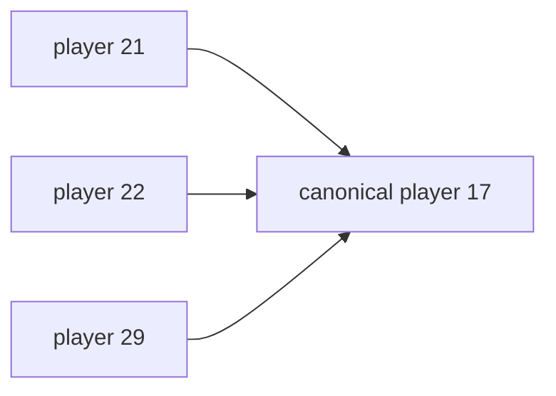

# Хешування канонізація і відсікання дублікатів

## Навіщо розпізнавати повтори

Гравець може ходити по колу, а ящик — повертатися до попередньої позиції. Без таблиці відвіданих станів граф має нескінченну кількість маршрутів до тих самих вершин.

```text
S --R--> A --L--> S --R--> A ...
```

Solver зберігає не маршрути, а унікальні стани та найкращу відому інформацію про них.

## Рівність GameState

Два стани рівні тоді й лише тоді, коли збігаються:

- `player`;
- увесь відсортований `boxes`.

Стіни й цілі не входять у стан, бо всі позиції одного пошуку належать тому самому `Board`.

## StateHasher

Поточні hash tables використовують 64-бітне FNV-подібне змішування:

```text
h = offset basis
mix(player)
for box in sorted boxes:
    mix(box)

mix(v):
    h = h XOR v
    h = h * FNV prime
```

Хеш лише обирає bucket. `unordered_map` або `unordered_set` потім викликає повну рівність `GameState`, тому колізія хешів не робить різні позиції однаковими.

## BoxConfigHasher

Кеш евристики залежить лише від ящиків, тому окремий hasher змішує тільки відсортований список `boxes`. Дві позиції гравця з однаковими ящиками отримують спільне `h`.

## Як різні solver-и використовують повтори

| Solver | Таблиця | Політика |
|---|---|---|
| BFS | `visited state -> node index` | перший візит є найкоротшим у рухах |
| A* | `bestG state -> cost` | дешевший шлях оновлює запис і перевідкриває стан |
| Greedy | `closed set` | перший візит назавжди перемагає |
| IDA* | `stateStack` | лише цикл у поточній гілці |

## Канонізація для A* Pushes

За метрики штовхань усі позиції гравця в одній області без ящиків мають нульову взаємну ціну. A* знаходить мінімальний індекс доступної області та використовує його як `player` у ключі `bestG`.



Фізичний вузол усе одно зберігає справжню позицію, щоб відновити маршрут підходу.

Для Moves та Greedy такої канонізації немає. У Greedy це означає, що одна конфігурація ящиків із різними позиціями гравця може зберігатися кілька разів.

## Zobrist hashing

Клас `Zobrist` детерміновано генерує випадкові 64-бітні числа для:

- гравця на кожній клітинці;
- ящика на кожній клітинці.

Хеш стану — XOR відповідних чисел. Переміщення можна оновити за `O(1)`:

```text
hash ^= table[from] ^ table[to]
```

Це корисно, коли стан мутує на місці й потрібне дуже швидке incremental hashing.

## Фактичне використання Zobrist

A* створює `zobrist_` у `start`, але далі його не використовує. BFS, A*, IDA* і Greedy покладаються на `StateHasher` або `BoxConfigHasher`. Отже Zobrist у цій версії — готова, протестовувана окремо концепція, але не активна оптимізація пошуку.

## Приклад дубліката

```text
#######
#  @  #
#  $ .#
#     #
#######
```

Маршрути `L R` і `R L` можуть повернути гравця до тієї самої позиції без руху ящика. BFS створить кандидат, але `visited_.emplace` не вставить його вдруге й збільшить `duplicatePruned`.

## Основні файли

- `src/core/GameState.hpp`;
- `src/solvers/Zobrist.cpp`;
- таблиці повторів у файлах конкретних solver-ів.
