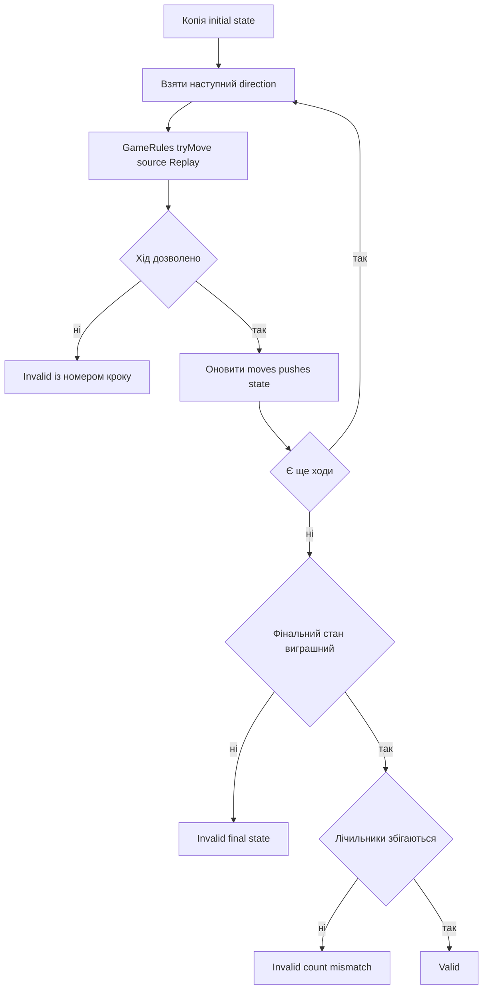

# Відновлення і перевірка рішення

## Чому знайдений goal state недостатній

Solver може правильно знайти виграшний вузол, але помилитися під час збирання маршруту, підрахунку штовхань або склеювання макроребер. Тому кожне локальне рішення повторно виконується через звичайні правила гри.

## Відновлення BFS

Кожен `BFSNode` зберігає один напрямок і `parentIndex`.

```text
Goal <- N3 <- N2 <- N1 <- Start
```

Алгоритм іде назад, додає `move`, рахує `pushed`, потім розвертає масив.

## Відновлення A* і Greedy

Їхній parent link містить `MacroEdge`:

```text
MacroEdge.steps = [кроки підходу..., штовхання]
```

Спочатку розвертається список макроребер, потім їхні `steps` послідовно додаються до `fullMoves`. Кожне макроребро означає рівно одне штовхання.

## Відновлення IDA*

IDA* не потребує глобальних parent links. Коли DFS знаходить ціль, `path_` уже містить усі `PushAction` від старту до фінішу. Їхні `steps` просто склеюються.

## ReplayValidator



Валідатор перевіряє чотири властивості:

1. кожна команда легальна;
2. після всіх команд усі ящики на цілях;
3. фактична кількість рухів дорівнює `solution.moveCount`;
4. фактична кількість штовхань дорівнює `solution.pushCount`.

## Приклад помилки

Для карти:

```text
#####
#@$.#
#####
```

маршрут `R` легальний і виграшний. Але якщо `Solution` заявляє `moveCount = 0`, валідатор спочатку виконає рух, потім поверне:

```text
Move count mismatch: expected 0 but replay took 1
```

## Статуси після перевірки

Локальні solver-и публікують `Solved` лише після успішної валідації. Помилка реконструкції перетворює статус на `InternalError`.

Web native bridge додатково викликає валідатор для отриманого `Solution`. Зовнішній web AI не створює C++ `Solution`: маршрут додається до історії й програється через `GameSession`; виграшний фінальний snapshot виконує еквівалентну перевірку.

## Довіра до AI

Рядок `UDLR`, отриманий від зовнішньої моделі, не має привілеїв. Він або проходить ті самі правила, або відкидається. Пояснення моделі не впливає на результат.

## Складність

Для маршруту довжини `L` валідатор виконує `L` переходів. Через копіювання станів і операції з відсортованим списком ящиків практична вартість приблизно `O(L * K log K)` у випадку багатьох штовхань; пам’ять — один поточний стан.

## Основні файли

- `src/solvers/ReplayValidator.cpp`;
- реконструкція у `BFSSolver.cpp`, `AStarSolver.cpp`, `IDAStarSolver.cpp`, `GreedySolver.cpp`.
