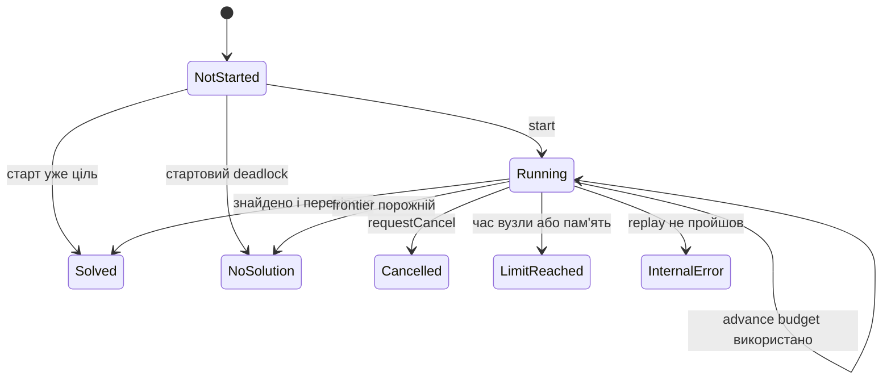

# Життєвий цикл solver ліміти і trace

## Спільний інтерфейс

Усі локальні алгоритми реалізують `ISolver`:

```text
start(board, state, options)
advance(nodeBudget)
requestCancel()
progress()
debugState()
statistics()
solution()
```

Цей контракт дозволяє CLI, comparator і web запускати різні алгоритми однаковим способом.

## Стани пошуку



`InvalidLevel` оголошений у enum, але парсер зазвичай кидає виняток до створення solver-а, тому внутрішні solver-и його не встановлюють.

## Кооперативний advance

`nodeBudget` обмежує кількість розкритих вузлів за один виклик. Після витрачання бюджету solver повертає `Running`, зберігаючи структури пошуку.

- BFS і A* продовжують із тієї самої черги;
- Greedy продовжує з priority queue;
- IDA* повертається зі стеку й наступного разу перезапускає поточну bound-ітерацію.

CLI зазвичай викликає `advance(10000)` у циклі. Web bridge перші кадри збирає бюджетом `1`, а після 160 trace points переходить на `1000`.

## Ліміти

`SolverOptions` задає:

| Поле | Типове значення | Перевірка |
|---|---:|---|
| `timeLimit` | 60 секунд | `steady_clock` від початку search |
| `nodeLimit` | 1 000 000 | `exploredStates` |
| `memoryLimitBytes` | 512 MiB | приблизна оцінка структур |
| `enableDeadlockDetection` | true | вмикає відсікання тупиків |
| `enableSafeMode` | true | зараз не використовується |
| `collectDebugState` | false | збирає останній реальний кадр пошуку |

Memory limit не читає фактичний RSS процесу. Кожен solver оцінює свої контейнери через `sizeof`, кількість елементів і грубу надбавку на hash-node. Це орієнтир, а не точний профайлер.

## Скасування

`requestCancel` встановлює `atomic<bool>`. Цикл перевіряє прапорець між розкриттями вузлів. Це кооперативне скасування: поточний короткий блок, наприклад Hungarian calculation, не переривається посередині.

У web застосовується ще один рівень: `AbortController` завершує дочірній native process. Тому браузерне скасування не викликає C++ `requestCancel`, а зупиняє весь процес.

## Часові метрики

`SearchStatistics` розділяє:

- `preprocessingTime` — очищення структур і початкова підготовка solver-а;
- `searchTime` — сума часу всередині `advance`;
- `reconstructionTime` — збирання маршруту;
- `validationTime` — ReplayValidator;
- `totalSolverTime` — сума попередніх фаз.

Парсинг рівня, UI, IPC і анімація сюди не входять.

Для успішного рішення всі локальні solver-и заповнюють повну суму після replay. Для раннього `Cancelled` або `LimitReached` поведінка нерівномірна: IDA* записує preprocessing плюс search, а BFS, A* і Greedy можуть залишити `totalSolverTime` з початковим значенням, хоча `searchTime` вже накопичений. Тому при аналізі незавершених запусків надійніше дивитися на окремі фазові поля.

## Debug state

За `collectDebugState = true` solver зберігає останній стан, який реально дістав із frontier або відвідав у DFS:

```text
state, g, h, depth,
hasTransition, pushed, direction,
boxFrom, boxTo
```

Це не повне дерево пошуку. Web показує послідовність вибраних frontier states; сусідні кадри можуть належати різним гілкам.

## Trace у native bridge

До trace додається точка, коли змінилися `explored`, `frontier` або `status`. Перші 160 викликів працюють по одному вузлу, щоб дати детальну анімацію. Після цього збільшений budget обмежує розмір JSON і прискорює завершення.

## Реєстр solver-ів

`SolverRegistry` перетворює enum або текст на конкретний об’єкт. Підтримуються псевдоніми:

- `astar`, `a*`, `a_star`;
- `idastar`, `ida*`, `ida_star`, `ida`;
- `greedy`, `gbfs`, `best-first` та варіанти.

## Основні файли

- `src/solvers/ISolver.hpp`;
- `src/solvers/SolverRegistry.cpp`;
- `bindings/web/native.cpp`.
