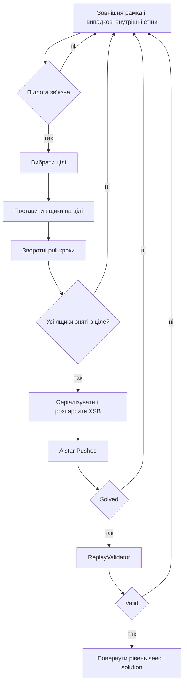

# Генератор розв’язних рівнів

## Основна стратегія

Генератор не розставляє ящики повністю навмання. Він починає з розв’язаного стану, де всі ящики стоять на цілях, виконує допустимі зворотні «підтягування», а потім незалежно перевіряє отриманий кандидат прямим A* і ReplayValidator.



## Нормалізація параметрів

- ширина й висота обмежуються `[5, 100]`;
- кількість ящиків — від `1` до `max(1, (innerCells - 3) / 4)`;
- `seed` або задається користувачем, або береться з високоточного годинника;
- PRNG — `std::mt19937_64`.

Однакові параметри, seed і версія коду дають однаковий результат, що перевіряє тест детермінізму.

## Зовнішні й внутрішні стіни

Спочатку створюється прямокутна зовнішня рамка. Далі випадково додається до 20 внутрішніх стін. Їхня максимальна кількість зменшується, коли поле мале або має багато ящиків.

Після цього звичайний BFS перевіряє, що всі вільні внутрішні клітинки утворюють одну зв’язну область. Кандидат із розірваною підлогою відкидається.

## Вибір цілей

Для невеликих полів список вільних клітинок просто перемішується. Для поля, більшого за `12` по ширині або висоті, спочатку вибирається центральна область, клітинки сортуються за мангеттенською близькістю до випадкового центра, а перемішування обмежується локальним pool. Це утримує задачу компактною й придатною для швидкої перевірки.

## Зворотне підтягування

У звичайному Sokoban ящик не можна тягнути. Генератор тимчасово використовує зворотну операцію для побудови задачі.

Для ящика `B` і напрямку `d`:

```text
pPos  = B + d      місце гравця біля ящика
pDest = B + 2d     куди гравець відступає
box moves B -> pPos
player moves pPos -> pDest
```

Перед вибором дії BFS знаходить усі клітинки, доступні гравцю без проходу через ящики. Підтягування допускається лише з досяжного `pPos`, на вільній підлозі `pDest`.

## Категорії дій

Пріоритет залежить від числа ящиків на цілях:

1. зняти ящик із цілі на нецільову клітинку;
2. перемішати вже знятий ящик;
3. перемістити з цілі на іншу ціль як fallback.

Коли всі ящики зняті, генератор ще до 40 кроків продовжує перемішування. Кандидат відкидається, якщо хоча б один ящик лишився на цілі.

## Пряма верифікація

Кандидат проходить:

1. `LevelParser::parseString`;
2. A* з метрикою Pushes;
3. часовий і node limit;
4. вимогу ненульового маршруту й штовхань;
5. `ReplayValidator`.

Зворотна конструкція підвищує шанс розв’язності, але саме прямий solver і replay є остаточним доказом для повернутого кандидата.

## Серіалізація XSB

`serializeToXsb` знаходить bounding box усіх стін, цілей, ящиків і гравця, після чого записує пріоритет символів:

```text
player -> @ або +
box    -> $ або *
goal   -> .
wall   -> #
інше   -> пробіл
```

## Web параметр точної кількості стін

Основний `LevelGenerator` сам випадково обирає число внутрішніх стін. Web bridge, щоб виконати запит `walls = N`, перебирає послідовні seed. Для кожного seed він спочатку повторює лише перший random draw і запускає генератор, якщо draw дорівнює `N`. Потім ще раз рахує стіни в готовому XSB.

## Можливий результат failure

Навіть коректні параметри не гарантують успіх у межах `maxAttempts`: випадкові кандидати можуть бути непридатні або solver може досягти ліміту. Тоді повертаються `success = false`, використаний seed, число спроб і повідомлення.

## Основні файли і тести

- `src/solvers/LevelGenerator.cpp`;
- web-обгортка: `bindings/web/native.cpp`;
- `tests/test_generator.cpp`.
