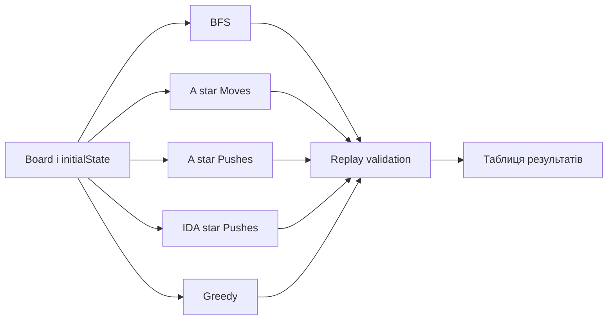

# Порівняння алгоритмів і бенчмарки

## Два різні інструменти

`AlgorithmComparator` запускає п’ять конфігурацій один раз і формує зрозумілу таблицю для користувача. `BenchmarkRunner` виконує прогрівання, кілька повторів і виводить медіанні часові показники у table, CSV або JSON.

## Набір алгоритмів

| Назва | Solver | Метрика | Заявлена оптимальність |
|---|---|---|---|
| BFS | BFS | Moves | так, рухи |
| A* Moves | A* | Moves | так, рухи |
| A* Pushes | A* | Pushes | так, штовхання |
| IDA* Pushes | IDA* | Pushes | так, штовхання |
| Greedy | Greedy | Pushes | ні |

Кожен запуск отримує однакові рівень, початковий стан, time limit, node limit, memory limit і deadlock detection.

## Потік Comparator



Рішення потрапляє у звіт лише після окремого `ReplayValidator`. Якщо термінал вужчий за 105 колонок, `printTable` прибирає розкриті стани, тупики й оптимальність, щоб рядки не переносилися.

## Що означають метрики

| Поле | Значення |
|---|---|
| `moves` | довжина перевіреного replay |
| `pushes` | штовхання у replay |
| `generatedStates` | легальні кандидати до частини відсікань |
| `exploredStates` | вузли, реально розкриті алгоритмом |
| `duplicatePruned` | повтори або некращі шляхи |
| `deadlockPruned` | стани, відкинуті як тупики або `h = INF` |
| `maxFrontierSize` | найбільша черга, або глибина path для IDA* |
| `estimatedPeakBytes` | приблизна пам’ять власних структур solver-а |

Значення не завжди прямо зіставні між алгоритмами. Один BFS-вузол — один рух, а один A*-вузол — одне макроштовхання. `exploredStates = 1000` у них означає різну гранулярність роботи.

## Розділення часу

```text
totalSolverTime = preprocessingTime
                + searchTime
                + reconstructionTime
                + validationTime
```

`searchTime` не включає парсинг XSB, друк, UI, анімацію або зовнішній AI. У comparator відображається саме чистий search time.

## BenchmarkRunner

Для кожного рівня й алгоритму:

1. рівень парситься один раз;
2. виконується один warm-up, який не входить у результат;
3. виконується `repeats` вимірюваних запусків;
4. для кожної часової фази береться медіана;
5. структурні лічильники й пам’ять беруться з останнього запуску.

Функція медіани сортує значення і повертає елемент `size / 2`. Для парної кількості повторів це верхня з двох центральних величин, а не їх середнє.

## Приклад читання таблиці

```text
Algorithm       Moves  Pushes  Explored  Search ms
BFS                20       5     12000      18.2
A* Moves           20       5       900       4.1
A* Pushes          27       4       350       1.9
```

Тут A* Pushes знайшов менше штовхань, але більше повних рухів. Це не суперечність: алгоритми оптимізують різні цільові функції.

## Обмеження експерименту

- приблизна пам’ять не є RSS;
- різна гранулярність вузлів ускладнює пряме порівняння explored;
- один парсинг поза повтореннями не входить у solver time;
- JSON-вивід формує рядки вручну й не екранує назву рівня;
- алгоритми виконуються послідовно, а не паралельно;
- зовнішній AI не входить у стандартний benchmark.

## CLI команди

```powershell
./sokoban_cli.exe compare levels/02_microban.xsb --timeout 30
./sokoban_cli.exe benchmark levels/benchmarks --repeat 5 --format csv --output result.csv
./sokoban_cli.exe benchmark levels/01_simple.xsb --algorithm astar
```

## Основні файли

- `src/cli/AlgorithmComparator.cpp`;
- `src/cli/BenchmarkRunner.cpp`;
- `tests/test_comparator.cpp`.
