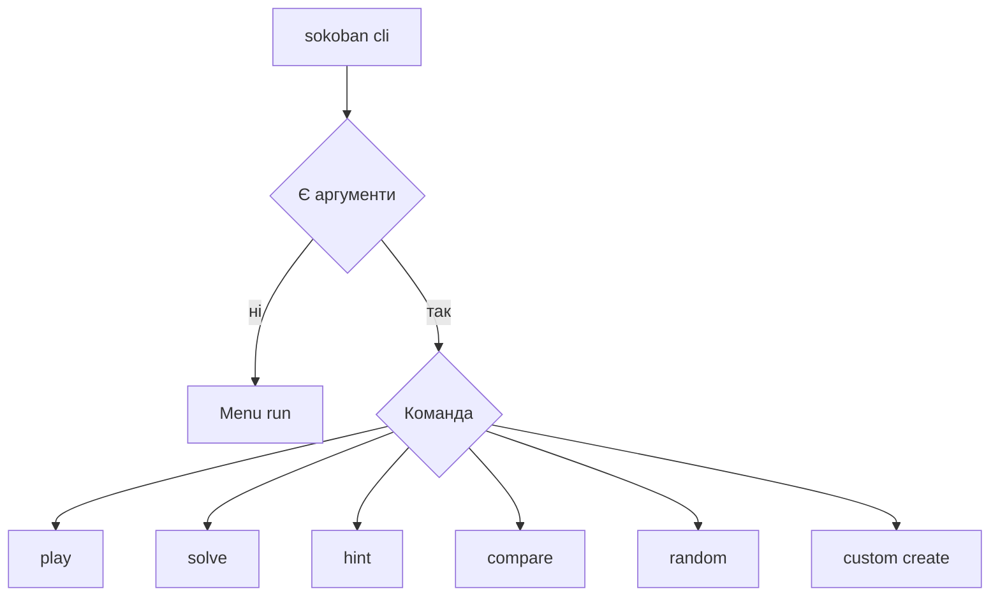
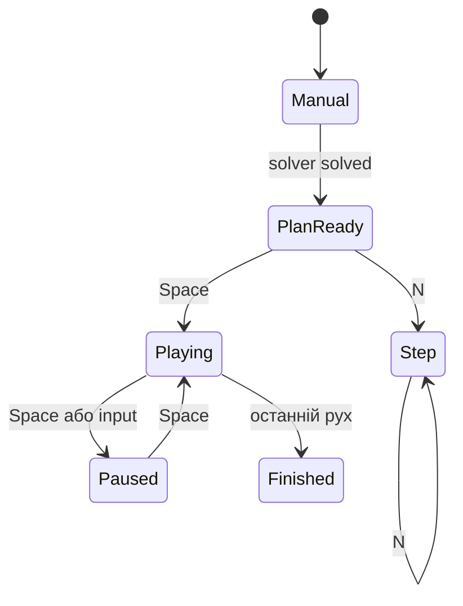

# Механіки командного рядка і термінальної гри

## Два режими CLI

Без аргументів `sokoban_cli` відкриває інтерактивне меню. З аргументами `main.cpp` маршрутизує команди `play`, `solve`, `hint`, `compare`, `random`, `custom` або `create`.



## Команди

```powershell
./sokoban_cli.exe play levels/01_simple.xsb
./sokoban_cli.exe solve levels/02_microban.xsb --algorithm astar --metric pushes
./sokoban_cli.exe hint levels/02_microban.xsb --algorithm astar
./sokoban_cli.exe compare levels/02_microban.xsb --timeout 30
./sokoban_cli.exe random --width 7 --height 7 --boxes 2 --seed 42
./sokoban_cli.exe benchmark levels/benchmarks --repeat 5 --format json
```

## Інтерактивна сесія

`runGame` створює `GameSession`, локальний план рішення, індекс replay, таймер гравця і стан камери. Головний цикл:

1. обчислює час;
2. готує активний елемент бокової панелі;
3. рендерить поле;
4. виконує наступний autoplay-крок, якщо він увімкнений;
5. читає клавішу;
6. застосовує відповідну механіку.

## Клавіші руху

WASD і стрілки перетворюються на `Direction`. Ручний рух:

- зупиняє autoplay;
- видаляє поточний AI-план;
- надсилає `MoveCommand` із `CommandSource::Human`;
- оновлює текстову історію;
- після штовхання запускає deadlock detector і лише попереджає користувача.

## Undo Redo Restart

- `U` викликає `GameSession::undo`;
- `Y` або `Ctrl+Z` викликає `redo`;
- `R` відновлює початковий стан, очищає план, лічильники й таймер.

## Локальне розв’язання

Клавіші вибирають solver і метрику:

| Клавіша | Режим |
|---|---|
| `B` | BFS Moves |
| `M` | A* Moves |
| `P` або `1` | A* Pushes |
| `I` | IDA* Pushes |
| `O` | Greedy Pushes |

`solveLocal` запускає `advance(10000)` до фінального статусу. Успішний маршрут не виконується одразу: `applySolution` зберігає його для покрокового або автоматичного відтворення.

## Підказка

`H` запускає A* Pushes з поточного стану, лімітом 10 секунд і 500 000 вузлів. UI показує перший звичайний рух повного маршруту, а не обов’язково напрямок першого штовхання.

## Replay і autoplay

`N` застосовує одну команду плану через `GameSession::apply` із джерелом `AI`. Пробіл перемикає autoplay; кожен крок має затримку приблизно 130 мс. Якщо плану ще немає, пробіл спочатку запускає A* Pushes.



## Порівняння з поточної позиції

`T` запускає comparator не з початку рівня, а з `session.currentState`. Після таблиці користувач може вибрати рядок і застосувати його перевірене рішення. За наявності API-ключа додатково запускається зовнішній AI.

Поточний рядок AI позначає `isOptimal = true` і текст `AI (перевірено)`. Це означає лише, що маршрут легальний і виграшний; зовнішня модель не доводить мінімальність. У документації й під час аналізу цей прапорець не слід трактувати як математичну оптимальність.

## Камера і рендеринг

`TerminalUI` визначає розмір термінала. Для великого поля режим камери вирізає область навколо гравця; `C` перемикає повний огляд. ANSI-кольори вимикаються, якщо встановлено `NO_COLOR` або `TERM=dumb`. Windows guard тимчасово вмикає UTF-8 і virtual terminal processing.

## Створення власного рівня

Menu підтримує:

- завантаження `.xsb`;
- ручне введення XSB;
- процедурну генерацію;
- вирівнювання числа ящиків і цілей;
- seed;
- запуск гри й подальше збереження.

Збереження під час гри серіалізує поточний стан, а не обов’язково початкову позицію.

## Основні файли

- `src/cli/main.cpp`;
- `src/cli/TerminalUI.cpp`;
- `src/cli/Menu.cpp`.
