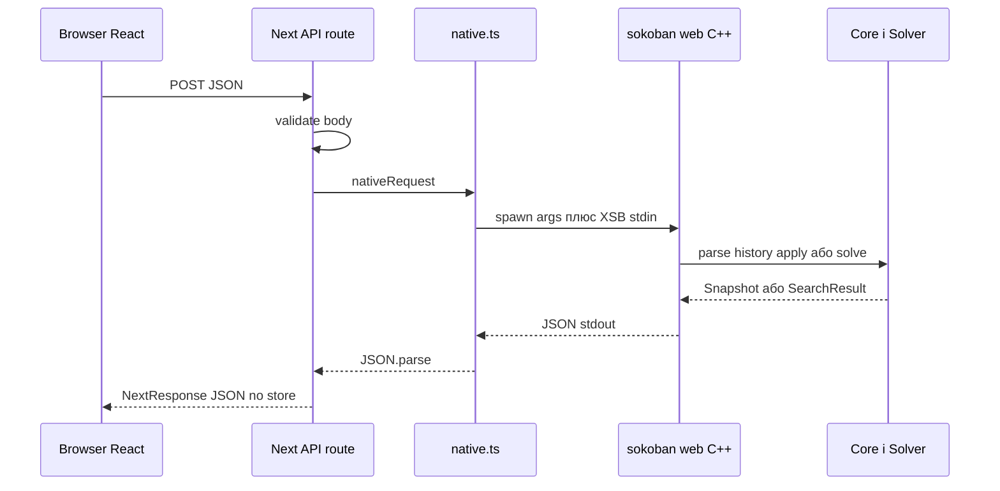

# Web міст і серверний API

## Архітектурне рішення

Web-версія не дублює правила на TypeScript. Next.js запускає окремий нативний C++ процес `sokoban_web`, передає XSB через stdin, аргументи через command line і читає один JSON зі stdout.



Це нативний subprocess-bridge, а не WebAssembly, попри згадки про WASM у старих планах.

## Відтворення history

Кожен запит отримує рядок `history` з `U`, `D`, `L`, `R`. C++:

1. парсить оригінальний рівень;
2. створює новий `GameSession`;
3. послідовно застосовує всю history як `Replay`;
4. при першій нелегальній команді повертає `{"error":"InvalidHistory"}`.

Сервер не тримає ігрову сесію між HTTP-запитами. Поточний стан є чистою функцією від XSB і history.

## Режим state

Після відтворення history може бути застосований один новий `direction` як Human. Відповідь містить:

- `accepted`, `won`, `moves`, `pushes`;
- ширину, висоту, маски стін, цілей і підлоги;
- позицію гравця й список ящиків.

Якщо direction порожній, `accepted` лишається `true`, а API працює як завантаження snapshot.

## Режим solve

Текстовий id алгоритму перетворюється на `SolverKind` і metric. Native bridge задає:

- debug collection;
- 8 секунд і 250 000 вузлів для звичайної задачі;
- 30 секунд і 2 000 000 вузлів для поля понад 2500 клітинок або понад 6 ящиків;
- 256 або 512 MiB приблизного memory limit.

Рішення ще раз проходить ReplayValidator. JSON включає маршрут, штовхання, фазові часи, статистику й обмежений trace.

## Запуск процесу native.ts

`runNative` використовує `spawn`, збирає stdout/stderr, задає timeout і слухає `AbortSignal`.

```text
timeout -> child.kill()
abort   -> child.kill()
exit != 0 -> reject зі stderr
exit == 0 -> JSON.parse(stdout)
```

На Windows процес запускається з `windowsHide: true`.

## Валідація game API

`/api/game` обмежує:

- весь body — 30 000 символів;
- `history` — regex `^[UDLR]{0,10000}$`;
- direction — один символ UDLR або порожньо;
- mode — `state` чи `solve`;
- algorithm — лише `LOCAL_ALGORITHMS`;
- custom XSB — до 10 500 символів і лише XSB-алфавіт.

Після цього C++ парсер виконує семантичну перевірку карти.

## API генерації

`/api/generate` перевіряє числові межі, seed у діапазоні `uint64`, максимум ящиків і максимум внутрішніх стін. Native bridge перебирає seed, щоб фактичний random draw числа стін дорівнював запиту, і повертає вже розв’язаний та перевірений рівень.

## Таймаути

Node wrapper зазвичай чекає 12 секунд. Для solve власного рівня — 40 секунд, для генерації — 30 секунд. Внутрішній C++ time limit може бути коротшим або довшим; першим спрацьовує той механізм, який реально завершує роботу.

## JSON серіалізація C++

Native binary формує JSON вручну. `jsonString` екранує керівні символи для XSB генератора. Solve/state містять числові й булеві поля з контрольованих значень, тому окрема JSON-бібліотека не використовується.

## Основні файли

- `bindings/web/native.cpp`;
- `web/src/lib/native.ts`;
- `web/src/app/api/game/route.ts`;
- `web/src/app/api/generate/route.ts`.
