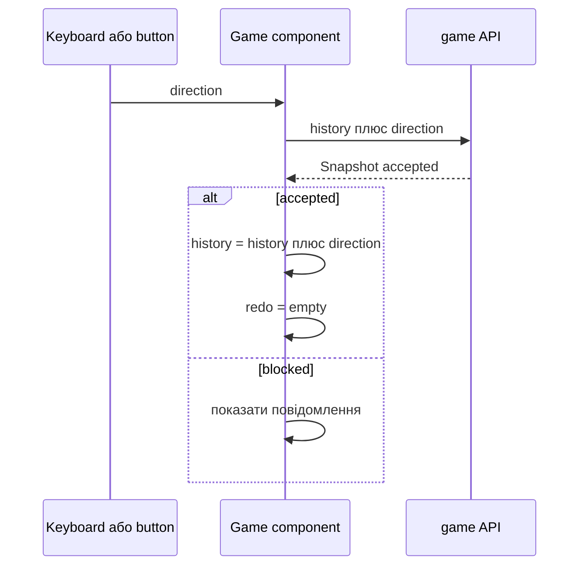

# Механіки web клієнта

## Модель стану браузера

Компонент `Game` зберігає:

```text
snapshot  поточне поле і позиція від сервера
history   рядок прийнятих UDLR
redo      стек скасованих символів
```

Сервер не пам’ятає сесію. Після кожної дії клієнт надсилає history, а C++ заново відтворює її.

## Рух

`move(direction)` зупиняє autoplay, скасовує активний пошук і викликає `transition`.



`lock.current` не дозволяє накладати два state transitions. `gameController` скасовує pending request під час unmount.

## Web Undo і Redo

Undo не викликає C++ `GameSession::undo`. Клієнт забирає останній символ history, додає його у `redo` й просить сервер побудувати snapshot зі скороченої історії.

```text
history UDLR -> UDL
redo []      -> [R]
```

Redo бере останній символ зі стека та виконує звичайний transition. Через таку модель web підтримує багатокрокову redo-послідовність незалежно від внутрішнього core redo stack.

## Restart

Restart запитує snapshot для порожньої history, очищає redo, план і таймер. Оригінальний XSB лишається тим самим.

## Пошук і скасування застарілих результатів

`solve` створює `AbortController` і запам’ятовує числовий `version`. `cancelSearch`:

- збільшує version;
- abort-ить запит;
- прибирає searching state.

Навіть якщо старий promise завершиться, token уже не збігається з новою version, тому результат не зберігається.

## Порівняння

У режимі compare `Promise.allSettled` одночасно запускає всі локальні алгоритми. Кожен результат зберігається як `Decision` разом із `base` — історією, від якої він був обчислений.

Перед застосуванням плану компонент перевіряє, чи поточна history збігається з base. Якщо ні, спочатку відновлює base snapshot, і лише потім запускає replay.

## План і replay

```text
Plan = SearchResult + base + index
```

Для кроку `i` клієнт запитує snapshot для:

```text
base + result.moves.slice(0, i)
```

Отже кожен кадр знову підтверджений C++ правилами. Автовідтворення працює через `setTimeout(speed)`, пауза лише зупиняє планування наступного кадру.

## Збереження в sessionStorage

Результати алгоритмів і останній застосований план зберігаються на час вкладки. Ключ включає id рівня та FNV-подібний fingerprint власного XSB.

`restoreDecision` не довіряє довільному JSON: перевіряє алгоритм, статус, UDLR, числові поля, trace і максимальні довжини AI prompt/response.

## Клавіатура

Підтримуються стрілки, WASD і відповідні українські клавіші. `U`, `Y`, `R`, пробіл і `N` керують історією та replay. Обробник ігнорує вводи в `input`, `select`, `textarea`, contenteditable і комбінації з Ctrl/Meta/Alt.

## Камера BoardView

Для поля понад 22 видимі клітинки хоча б в одному вимірі вмикається camera mode:

- поле зору обмежується `[7, 41]`;
- за замовчуванням камера слідує за гравцем;
- drag змінює центр;
- wheel змінює field of view;
- Shift плюс напрямок панорамує expanded map.

Core додає XSB рамку, тому BoardView показує `width - 2` на `height - 2` і зміщує всі індекси на одну клітинку.

## Доступність і motion

Поле має `role=img` і текстовий `aria-label`. Debugger автоматично не запускає анімацію, якщо `prefers-reduced-motion: reduce`. Кнопки вимикаються під час несумісних операцій, а expanded map переводить фокус на кнопку закриття.

## Основні файли

- `web/src/components/Game.tsx`;
- `web/src/components/BoardView.tsx`;
- `web/src/components/ComparisonReplay.tsx`.
