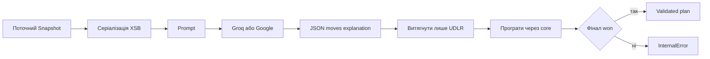

# Інтеграція зовнішнього ШІ

## Роль зовнішньої моделі

Groq або Google AI генерує кандидатний рядок рухів `UDLR`. Модель не змінює правила гри й не отримує довіри до свого висновку. Маршрут застосовується тільки після локальної перевірки C++ ядром.



## Визначення провайдера

Ключ очищається від пробілів і зовнішніх лапок.

```text
AIza... або AQ.  -> Google AI
будь-який інший -> Groq
```

Це евристика за префіксом, а не криптографічна перевірка ключа.

## Prompt

Обом провайдерам передається XSB і правила символів. Вимагається повний маршрут, лише `U`, `D`, `L`, `R`, JSON без markdown і коротке пояснення українською.

Google-варіант додатково просить використати code execution та задає response schema. Groq отримує OpenAI-сумісний `chat/completions`, `temperature = 0`, `max_tokens = 4096` і `response_format = json_object`.

## Web flow

1. `/api/ai` перевіряє body, history, custom XSB, key і model allowlist.
2. Через native state API отримує поточний перевірений snapshot.
3. Серіалізує snapshot у XSB.
4. Викликає Groq або Google.
5. Витягує `moves` лише за regex `UDLR`, максимум 10 000 символів.
6. Просить native core відтворити `history + moves`.
7. Вважає результат валідним лише за `final.won`.
8. Рахує нові штовхання як різницю фінального й початкового snapshot.

API-ключ браузер зберігає у `sessionStorage`, а потім надсилає server route у кожному AI-запиті. Сервер не записує його в репозиторій.

## CLI flow

`AiClient` шукає ключ у такому порядку:

1. `GROQ_API_KEY`;
2. `~/.sokoban_ai_key`;
3. legacy Google environment variables або legacy key file.

Транспорт навмисно використовує системний `curl.exe` через `popen`, щоб не додавати HTTP-бібліотеку. JSON body записується у тимчасовий файл; response теж читається з тимчасового файла, після чого обидва видаляються.

В інтерактивній грі маршрут програється через тимчасовий `GameSession`, перевіряється `isWon`, окремо рахує штовхання і лише тоді стає планом.

## Retry

### Web клієнт

`Game.requestGemini` повторює весь `/api/ai` запит до трьох разів для `408`, `429` і `5xx` із приблизним backoff `1s`, `2s` плюс jitter.

### Web server provider call

Groq при HTTP 400 один раз повторює запит без `temperature` і `response_format`. Інші provider-level retry у route не виконуються, тому клієнтський цикл є основним.

### CLI

CLI робить до трьох HTTP-спроб на `408`, `429`, порожню відповідь, network error або `5xx`; паузи — 2 і 4 секунди. Groq також один раз переходить на мінімальний body після 400.

## Прозорість

Web `SearchResult.aiSession` може містити model, prompt і raw response до 120 000 символів. Під час відновлення sessionStorage ці поля перевіряються за типом і довжиною. Пояснення обрізається до 500 символів.

## Гарантії й не гарантії

Гарантується після успішної локальної перевірки:

- усі рухи легальні;
- фінальний стан виграшний;
- число штовхань пораховане ядром.

Не гарантується:

- мінімальність рухів;
- мінімальність штовхань;
- стабільність відповіді між запитами;
- доступність моделі або free tier;
- пояснення, що точно відповідає внутрішньому reasoning моделі.

## Поточні реалізаційні межі CLI

У команді `solve --algorithm ai` C++ створює `Solution`, але викликає `ReplayValidator` до заповнення `moveCount` і `pushCount`. Навіть легальний непорожній маршрут через це отримує count mismatch. Інтерактивна гра використовує інший validation flow і цієї помилки не має.

Крім того, CLI вставляє ключ у shell-команду curl. `setApiKey` обмежує довжину, але не має allowlist символів для ключа; файл ключа треба вважати довіреним локальним вводом.

## Основні файли

- `web/src/app/api/ai/route.ts`;
- `web/src/components/Game.tsx`;
- `src/cli/AiClient.cpp`;
- AI-виклики у `src/cli/TerminalUI.cpp` і `src/cli/main.cpp`.
