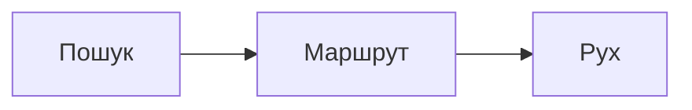

# Навчальні візуалізації і debugger

## Два типи навчального контенту

Web-частина має статичні покрокові уроки та debugger реального завершеного запуску solver-а.

| Механіка | Джерело даних |
|---|---|
| `LessonView` і `AlgorithmScene` | сценарії з `lessons.ts` плюс реальні уривки C++ |
| `SearchDebugger` | trace і snapshots конкретного запуску |

## Уроки з прив’язкою до коду

Кожен `Lesson` містить назву, вступ, складність, основний source file, кадри й висновок. Кадр має `anchor` — точний фрагмент рядка в коді.

`withSource`:

1. збирає унікальні source files уроку;
2. читає їх під час server/build;
3. знаходить перший рядок, що містить anchor;
4. бере задану кількість рядків;
5. прибирає спільний відступ;
6. додає номер початкового рядка.

Якщо anchor зник після рефакторингу, build кидає помилку. Це не дає уроку непомітно показувати вигаданий або застарілий код.

## Trace реального пошуку

Native bridge вмикає `collectDebugState`. Після порцій `advance` він записує:

- скільки станів досліджено;
- розмір frontier;
- накопичений search time;
- статус;
- вибраний solver-ом фізичний стан;
- `g`, `h`, depth;
- останній перехід і координати ящика.

Перші 160 точок збираються після одного вузла, тому початок пошуку деталізований. Далі budget стає 1000, і trace переходить до грубішої гранулярності.

## Три фази SearchDebugger

### Пошук

Показується реальний стан, який solver дістав із черги або відвідав у DFS. Для A*-подібних алгоритмів UI показує `g`, `h`, `f`; для BFS — depth, frontier і explored.

Важливо: наступний кадр може належати іншій гілці. Це журнал вибору вузлів, а не одна безперервна партія.

### Маршрут

Debugger завантажує snapshots для префіксів готового replay, будує маркери позицій гравця й місць штовхання.

### Рух

Той самий перевірений replay показується як анімована послідовність фізичних станів.

## Завантаження кадрів маршруту

`ensureFrame(index)` кешує snapshot. Батьківський `Game` викликає state API для `base + moves.slice(0, index)`. Отже зображення кроку не моделюється в React і знову проходить C++ правила.

## Пояснення правил вибору

Debugger має окрему таблицю людських формулювань:

- BFS — FIFO і один рух на рівень;
- A* — найменше `g + h`;
- IDA* — DFS у межах bound;
- Greedy — лише найменше `h`;
- зовнішній AI — згенерований план без гарантії оптимуму.

## Reduced motion

Початкове autoplay trace вимикається, якщо браузер повідомляє `prefers-reduced-motion: reduce`. Користувач усе одно може переходити між кадрами вручну.

## Візуальна чесність

UI не малює абстрактну чергу, якої немає в solver-і. Він показує один вибраний стан і числовий frontier. Для IDA* поле `frontier` фактично є довжиною поточного шляху плюс один, а не шириною глобальної черги.

## Основні файли

- `web/src/lib/lessons.ts`;
- `web/src/lib/lesson-source.ts`;
- `web/src/components/LessonView.tsx`;
- `web/src/components/AlgorithmScene.tsx`;
- `web/src/components/SearchDebugger.tsx`.
