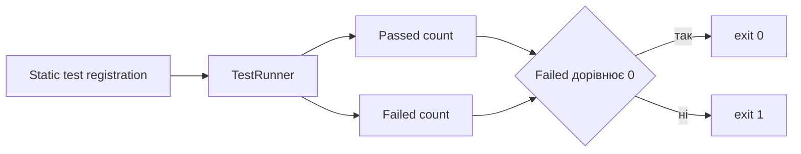

# Тестування і відомі межі реалізації

## Структура тестів

C++ має мінімальний власний test harness без зовнішнього framework. Макрос `SOKOBAN_TEST` реєструє функцію у singleton `TestRunner`, а `main` послідовно запускає всі кейси й повертає ненульовий код при помилці.



## Покриті механіки

| Файл | Основні перевірки |
|---|---|
| `test_parser.cpp` | XSB, кількості, символи, витік назовні |
| `test_rules.cpp` | крок, стіна, штовхання, два ящики, перемога |
| `test_undo_redo.cpp` | одиночні Undo/Redo, restart, нова гілка |
| `test_deadlocks.cpp` | кут, цільовий кут, 2 на 2, dead square, assignment |
| `test_solvers.cpp` | BFS, A*, IDA*, Greedy, limits, registry, replay |
| `test_generator.cpp` | solvability, seed, round trip, failure |
| `test_comparator.cpp` | п’ять рядків, метрики, таблиця |
| `test_ai.cpp` | чисті helper-и AI без мережі |
| `test_menu.cpp` | сценарії меню і власного рівня |

Web має native integration tests і Playwright-сценарії для сайту, уроків, порівняння та скасування.

## Ключові інваріанти

Тести підтверджують:

- BFS і A* Moves збігаються за мінімальною кількістю рухів на контрольному рівні;
- IDA* Pushes збігається з A* Pushes на малому рівні;
- кожне знайдене рішення проходить ReplayValidator;
- генерація з однаковим seed відтворюється;
- node limit переводить solver у `LimitReached`;
- нерозв’язний кут повертає `NoSolution`.

## Як запустити

```powershell
cmake -B build -G Ninja -DCMAKE_BUILD_TYPE=Release
cmake --build build
ctest --test-dir build --output-on-failure

cd web
npm run typecheck
npm run test:native
npm run test:e2e
```

## Відомі межі і нюанси

### Safe mode не під’єднано

`enableSafeMode` є в options і всюди встановлюється, але solver-и та deadlock detector його не читають. Він не змінює поведінку.

### Zobrist не бере участі в пошуку

A* створює таблицю Zobrist, але використовує `StateHasher`. Не можна приписувати поточним benchmark-ам приріст від incremental Zobrist hashing.

### Багатокроковий core Redo

`GameSession::redo` викликає `apply` з оригінальним `Human` source, який очищає залишок redo stack. Наявні тести перевіряють лише один скасований рух. Web має іншу history-based реалізацію й цього обмеження не успадковує.

### CLI solve через зовнішній AI

У `main.cpp` count fields `Solution` заповнюються після `ReplayValidator`, тому непорожній правильний AI-маршрут отримує mismatch. Інтерактивний CLI й web перевіряють інакше.

### Позначення оптимальності AI у CLI compare

Інтерактивний comparator ставить зовнішньому AI `isOptimal = true`, хоча перевірено лише легальність і перемогу. Математичної гарантії мінімуму немає.

### IDA* і малий nodeBudget

Після кооперативної паузи DFS stack не зберігається. Поточна bound-ітерація починається заново, що може повторювати роботу.

### Greedy metric

Поле options.metric записується, але внутрішній `g` Greedy рахує штовхання. Публічні інтерфейси правильно запускають його як Pushes.

### Пам’ять оцінюється приблизно

`estimatedPeakBytes` не враховує allocator overhead точно, capacity усіх vector-ів, стек процесу й бібліотеки. Порівнювати її слід як індикатор, не як фактичний RSS.

### Total time для ранньої зупинки

Після `Cancelled` або `LimitReached` BFS, A* і Greedy не в усіх гілках оновлюють `totalSolverTime`, хоча `searchTime` уже виміряний. Для незавершених запусків слід аналізувати фазові поля окремо.

### Deadlock detection неповний

Немає повного corral і pattern database аналізу. Невиявлений deadlock може лишитися в пошуку; головна вимога безпеки — не відкинути розв’язний стан помилково.

### Parser читає одну карту

XSB-файл із кількома рівнями не повертає колекцію. Після першої карти парсер зупиняється.

## Що ще варто тестувати

- два й більше послідовних core Undo, потім повна серія Redo;
- CLI `solve --algorithm ai` з mock response;
- property tests: кожен solver solution завжди проходить replay;
- випадкові малі рівні: BFS Moves дорівнює A* Moves;
- deadlock detector проти набору відомих розв’язних позицій;
- IDA* з дуже малими node budgets;
- JSON escaping для benchmark level names;
- завершення дочірнього web process після timeout/abort.

## Межа документації

Цей документ описує поточний код, а не заплановані можливості. Якщо реалізацію виправлено, відповідний пункт слід прибрати разом із додаванням regression test.
