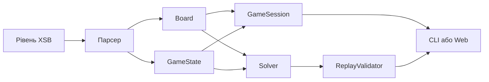

# Документація механік і алгоритмів SOKOBAN

Цей каталог пояснює фактичну реалізацію проєкту за поточним кодом. Кожна механіка винесена в окремий документ. Матеріал призначений для захисту курсової роботи, вивчення алгоритмів і супроводу коду.

## Як читати документацію

Якщо потрібно зрозуміти всю програму, почніть з архітектури, потім прочитайте модель поля, правила гри й життєвий цикл solver. Після цього окремо вивчайте алгоритми пошуку.

## Зміст

| № | Документ | Окрема механіка |
|---:|---|---|
| 1 | [Архітектура і модель даних](01_ARCHITECTURE_AND_DATA_MODEL.md) | Шари, потоки даних, статичний і динамічний стан |
| 2 | [Парсер рівнів XSB](02_XSB_PARSER.md) | Читання, flood fill зовнішнього простору, валідація |
| 3 | [Попередня обробка поля](03_BOARD_PREPROCESSING.md) | Сусіди, reverse-push BFS, статичні мертві клітинки |
| 4 | [Правила руху](04_GAME_RULES.md) | Крок, штовхання, перемога, запис переходу |
| 5 | [Сесія, Undo, Redo і Restart](05_SESSION_HISTORY.md) | Історія, лічильники, версія стану |
| 6 | [BFS](06_BFS.md) | Пошук у ширину по кожному руху |
| 7 | [Досяжність і макроштовхання](07_REACHABILITY_AND_MACRO_PUSHES.md) | Внутрішній BFS гравця та ребра між штовханнями |
| 8 | [Евристика і угорський алгоритм](08_HUNGARIAN_HEURISTIC.md) | Reverse-push відстані та мінімальне призначення |
| 9 | [A star](09_ASTAR.md) | Пріоритет `f = g + h`, дві метрики, reopening |
| 10 | [IDA star](10_IDASTAR.md) | Ітеративне поглиблення за межею `f` |
| 11 | [Greedy Best First Search](11_GREEDY.md) | Вибір лише за `h` без гарантії оптимальності |
| 12 | [Виявлення тупиків](12_DEADLOCK_DETECTION.md) | Dead squares, кути, 2 на 2, freeze, assignment |
| 13 | [Хешування і дублікати](13_HASHING_AND_DUPLICATES.md) | FNV-подібний хеш, рівність, канонізація, Zobrist |
| 14 | [Відновлення і перевірка рішення](14_REPLAY_VALIDATION.md) | Parent links, макроребра, ReplayValidator |
| 15 | [Життєвий цикл solver](15_SOLVER_LIFECYCLE_LIMITS_TRACE.md) | `start`, `advance`, скасування, ліміти, trace |
| 16 | [Генератор рівнів](16_LEVEL_GENERATOR.md) | Побудова від розв’язаного стану та перевірка A* |
| 17 | [Порівняння і бенчмарки](17_COMPARISON_BENCHMARKS.md) | Метрики, медіана, чесні межі вимірювання |
| 18 | [Механіки CLI](18_CLI_MECHANICS.md) | Команди, інтерактивна гра, підказка, autoplay |
| 19 | [Web міст і API](19_WEB_BRIDGE_AND_API.md) | Окремий C++ процес, JSON-контракт, валідація запитів |
| 20 | [Web клієнт](20_WEB_CLIENT.md) | Історія, Undo/Redo, replay, скасування, камера |
| 21 | [Зовнішній ШІ](21_EXTERNAL_AI.md) | Groq/Google, промпт, retry, локальна перевірка |
| 22 | [Навчальні візуалізації](22_LESSONS_VISUALIZATION.md) | Trace пошуку, debugger і уроки з фрагментами коду |
| 23 | [Тестування і відомі межі](23_TESTING_AND_KNOWN_LIMITS.md) | Що перевіряють тести та що код поки не гарантує |

## Позначення в прикладах

| Символ | Значення |
|---|---|
| `#` | стіна |
| пробіл | підлога або зовнішній простір до класифікації парсером |
| `@` | гравець |
| `$` | ящик |
| `.` | ціль |
| `*` | ящик на цілі |
| `+` | гравець на цілі |
| `U L D R` | вгору, вліво, вниз, вправо |

## Джерела істини

Опис спирається на `src/core`, `src/solvers`, `src/cli`, `bindings/web`, `web/src` і `tests`. Старий узагальнений файл [ALGORITHMS.md](ALGORITHMS.md) корисний як теоретичний конспект, але ця серія документів окремо позначає поведінку, яка реально присутня в коді, та відомі обмеження поточної версії.
