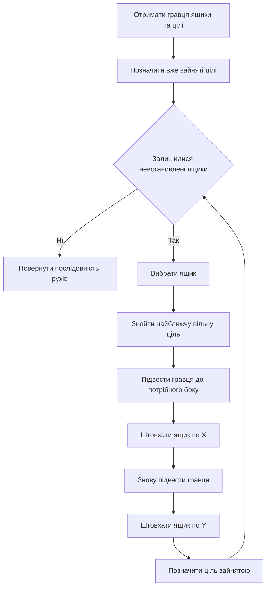

# Прототип 1 Послідовне переміщення ящиків на найближчі цілі

## Статус і призначення

Це навчальний прототип спрощеного solver-алгоритму для Sokoban. Він призначений для відкритих тестових полів із кількома ящиками та такою самою кількістю цілей. Алгоритм навмисно не враховує стіни під час побудови маршруту і не намагається знайти оптимальний розв'язок.

Головна ідея: послідовно брати невстановлені ящики, призначати кожному найближчу вільну ціль і переміщувати ящик спочатку по осі `X`, а потім по осі `Y`.

## Дані з наявної програми

Повторно сканувати двовимірне поле для пошуку об'єктів не потрібно. Після завантаження рівня необхідні позиції вже містяться у структурах програми:

```cpp
initial.player;       // позиція гравця
initial.boxes;        // позиції всіх ящиків
board.goals();        // позиції всіх цілей
```

Для прототипу використовуються:

- поточна позиція гравця;
- список поточних позицій ящиків;
- список цілей;
- масив ознак зайнятих цілей;
- результуюча послідовність команд `Up`, `Left`, `Down`, `Right`.

Стіни з `Board` не перевіряються. Межі прямокутного поля та інші ящики перевіряються, щоб алгоритм не вийшов за розмір рівня і не намагався пройти крізь ящик.

## Загальна схема



## Вибір цілі

Для кожного ящика перебираються всі ще не зайняті цілі. Вибирається ціль із найменшою мангеттенською відстанню:

```text
distance = abs(boxX - goalX) + abs(boxY - goalY)
```

Наприклад:

```text
Ящик B1: (2, 2)
Ціль G1: (7, 2)  distance = 5
Ціль G2: (3, 4)  distance = 3

B1 отримує G2.
```

Якщо кілька цілей мають однакову відстань, вибирається перша з них у `board.goals()`.

## Переміщення одного ящика

Спочатку ящик вирівнюється з ціллю по `X`:

- якщо ціль праворуч, гравець стає ліворуч від ящика та штовхає вправо;
- якщо ціль ліворуч, гравець стає праворуч від ящика та штовхає вліво.

Після цього ящик вирівнюється по `Y`:

- якщо ціль нижче, гравець стає над ящиком та штовхає вниз;
- якщо ціль вище, гравець стає під ящиком та штовхає вгору.

```text
Початок: B(2,2), G(5,4)

(2,2) -> (3,2) -> (4,2) -> (5,2) -> (5,3) -> (5,4)
          рух по X                  рух по Y
```

Після встановлення ящика ціль позначається зайнятою, а цей ящик більше не рухається.

## Примітивний псевдокод

```text
boxes = initial.boxes
goals = board.goals
goalUsed = false для кожної цілі
result = порожній список рухів

позначити цілі, на яких ящики стоять уже на початку

для кожного ящика, який ще не стоїть на цілі:
    goal = найближча незайнята ціль за Manhattan distance

    якщо цілі немає:
        завершити з помилкою

    підвести гравця до боку ящика
    якщо шлях перекритий іншим ящиком:
        завершити з помилкою

    поки boxX != goalX:
        штовхнути ящик у напрямку goalX
        оновити координати гравця і ящика

    підвести гравця до боку ящика
    якщо шлях перекритий іншим ящиком:
        завершити з помилкою

    поки boxY != goalY:
        штовхнути ящик у напрямку goalY
        оновити координати гравця і ящика

    позначити goal як зайняту

повернути result
```

## Приблизний каркас для програми

```cpp
std::vector<bool> goalUsed(board.goals().size(), false);
core::GameState currentState = initial;
std::vector<core::Direction> result;

for (core::CellIndex box : initial.boxes) {
    int bestGoal = -1;
    int bestDistance = std::numeric_limits<int>::max();

    const int boxX = board.toX(box);
    const int boxY = board.toY(box);

    for (std::size_t g = 0; g < board.goals().size(); ++g) {
        if (goalUsed[g]) {
            continue;
        }

        const int goalX = board.toX(board.goals()[g]);
        const int goalY = board.toY(board.goals()[g]);
        const int distance =
            std::abs(boxX - goalX) + std::abs(boxY - goalY);

        if (distance < bestDistance) {
            bestDistance = distance;
            bestGoal = static_cast<int>(g);
        }
    }

    if (bestGoal == -1) {
        return std::nullopt;
    }

    auto moves = solveOneBoxOpenField(
        board,
        currentState,
        box,
        board.goals()[bestGoal]
    );

    if (!moves) {
        return std::nullopt;
    }

    result.insert(result.end(), moves->begin(), moves->end());
    applyMoves(currentState, *moves);
    goalUsed[bestGoal] = true;
}

return result;
```

`solveOneBoxOpenField` реалізує рух `X -> Y`. Під час пошуку позиції для гравця вона не перевіряє стіни, але не дозволяє займати клітинки з іншими ящиками. `applyMoves` послідовно оновлює `currentState`, щоб наступний ящик оброблявся з актуальної позиції гравця та актуального розташування всіх ящиків.

## Частота сканування поля

Повне поле сканується парсером один раз під час завантаження рівня. Сам прототип не сканує поле повторно для пошуку гравця, ящиків або цілей, оскільки бере їх із `GameState` і `Board`.

Для `B` ящиків і `G` цілей вибір відповідностей потребує до `B * G` порівнянь. Якщо для підведення гравця використати BFS без урахування стін, він запускається максимум двічі на ящик: перед горизонтальною та вертикальною серіями штовхань. Один такий BFS може переглянути до `width * height` клітин.

Повного сканування після кожного штовхання немає. Позиції гравця і ящика оновлюються безпосередньо.

## Лімітації прототипу 1

1. **Стіни ігноруються.** Планувальник може створити маршрут крізь стіну. Стандартний `GameRules::tryMove()` відхилить такий рух, тому прототип придатний лише для спеціально підготовлених відкритих рівнів.

2. **Ящики обробляються по одному.** Алгоритм не планує спільну послідовність переміщення всіх ящиків.

3. **Встановлений ящик більше не рухається.** Він може перекрити шлях до іншої цілі, хоча правильне рішення вимагало б тимчасово зрушити його.

4. **Найближча ціль може бути неправильною.** Мангеттенська відстань не враховує напрямок штовхання, положення гравця, інші ящики та майбутні блокування.

5. **Завжди використовується порядок `X -> Y`.** Алгоритм не пробує варіант `Y -> X`, навіть якщо він дозволив би завершити рівень.

6. **Немає повернення до попереднього рішення.** Якщо вибраний ящик або ціль призвели до блокування, алгоритм завершується помилкою і не пробує інше призначення.

7. **Інший ящик на прямому маршруті зупиняє алгоритм.** Прототип не відсуває блокувальний ящик і не змінює порядок обробки.

8. **Немає виявлення тупиків.** Не перевіряються кути, заморожені ящики, конфігурації `2 x 2` та інші нерозв'язні стани.

9. **Немає гарантії знаходження рішення.** Прототип може повідомити про невдачу для рівня, який насправді має розв'язок.

10. **Немає гарантії оптимальності.** Знайдений маршрут може містити зайві кроки та штовхання.

11. **Потрібна однакова кількість ящиків і цілей.** За різної кількості об'єктів прототип повинен відразу завершитися помилкою.

12. **Початкові ящики на цілях потребують окремого обліку.** Їхні цілі потрібно позначити зайнятими до основного циклу, інакше інший ящик може отримати вже зайняту ціль.

13. **Маршрут планувальника не є дозволом на рух.** Перед показом або відтворенням результат усе одно необхідно перевірити через `ReplayValidator` або послідовні виклики `GameRules::tryMove()`.

## Умови, за яких прототип працює

Прототип може успішно завершити рівень, якщо:

- поле відкрите і не потребує обходу стін;
- кількість ящиків дорівнює кількості цілей;
- жоден ящик не перекриває прямий маршрут іншого;
- кожен ящик можна доставити до призначеної цілі шляхом `X -> Y`;
- уже встановлені ящики не потрібно переміщувати повторно;
- усі сформовані команди проходять перевірку правил гри.

Цей варіант доцільно використовувати як демонстраційний baseline для порівняння з BFS, A star, IDA star і Greedy, але не як повноцінний solver для довільних рівнів Sokoban.
