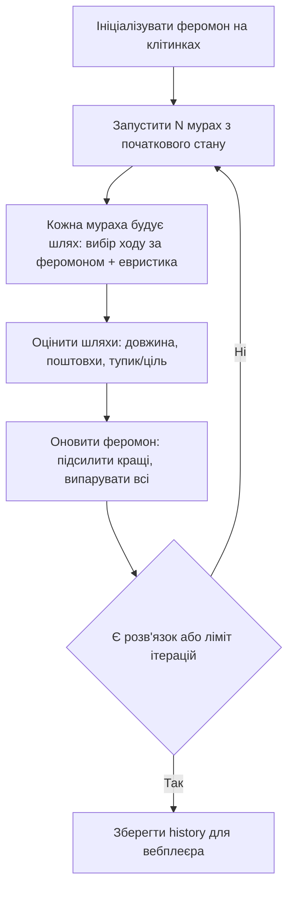

# Прототип 2 Візуалізація ACO (Ant Colony Optimization) у вебі

## Статус і призначення

Це пропозиція візуального прототипу ройового алгоритму для Sokoban у вебклієнті. Призначений для наочної демонстрації еволюційного пошуку: як рій мурах спочатку досліджує карту хаотично, а потім сходиться до найкоротшого маршруту навколо стін.

Головна ідея: кожен розв'язок моделюється як шлях мурахи (послідовність ходів/поштовхів). Успішні шляхи залишають віртуальний «феромон» на графі станів. Наступні покоління частіше обирають клітинки з більшою концентрацією феромону. Феромон з часом випаровується, тупикові коридори гаснуть, перспективні обходи стін підсилюються.

Обрано саме ACO серед PSO та ABC, тому що:
- ACO 1-в-1 лягає на карту Sokoban (мураха ходить по клітинках);
- PSO працює в абстрактному просторі послідовностей ходів — його «політ» не показати на карті, лише графіки;
- ABC з трьома ролями бджіл (розвідники/робітниці/спостерігачі) виглядає як випадкові точки без красивих стежок.

## Дані з наявної програми

Повторно сканувати поле не потрібно. Після завантаження рівня використовуються структури програми:

```cpp
initial.player;       // позиція гравця
initial.boxes;        // позиції всіх ящиків
board.goals();        // позиції всіх цілей
board;                // стіни для перевірки ходів
```

Для прототипу додатково зберігається лише історія треків:

```ts
type AntTrace = { antId: number; iter: number; cells: [x,y][]; pushes: number; cost: number; won: boolean };
// history[iter] = AntTrace[] — тільки координати, без кадрів canvas
```

Валідація маршруту — як у прототипі 1: результат перевіряється через `ReplayValidator` або послідовні виклики `GameRules::tryMove()` перед відтворенням.

## Загальна схема



## Режими вебплеєра

1. **Одна мураха.** Клік по мурасі у списку (сортування за `cost`) — ізолювати її шлях. Скрабер по `cells`: play/pause, крок вперед/назад, маркер причини зупинки (`ціль` / `deadlock` / `тупик`).
2. **Виграшна мураха.** Кнопка `показати winner` — золотий шлях `best-so-far` поверх карти. Режим `vs winner`: вибрана мураха сірим, виграшна золотим одночасно для порівняння.
3. **Усі мурахи одночасно.** Один глобальний крок `t = 0..maxSteps`, позиція кожної мурахи:
   ```ts
   pos = trace.cells[Math.min(t, trace.cells.length - 1)];
   ```
   Хвіст = `trace.cells.slice(0, t)`. Мураха що зупинилась — дійшла до цілі або тупика. Toggle `сліди on/off`, напівпрозорість неактивних.
4. **Поетапний запуск.** Слайдер/кнопки видимості: спочатку перші 20 мурах (`history[iter].slice(0, visible)`), потім `+20` / `всі`. Дозволяє роздивитись першопрохідців, а потім побачити як натовп накриває карту. Wave-анімація по 5 мурах як опція.

Загальні контроли: вибір покоління `1..M`, play всіх, швидкість, heatmap феромону on/off, два мініграфіки (довжина best, покриття карти).

## Примітивний псевдокод

```text
pheromone = 1.0 для кожної прохідної клітинки
history = порожній список
best = немає

для iter в 1..M:
    traces = []
    для ant в 1..N:
        path = побудувати шлях з початкового стану
               (на кожному кроці: з імовірністю p — хід за феромоном,
                інакше — випадковий допустимий хід за GameRules)
        cost = довжина + штраф за deadlock/тупик
        traces.додати({ant, iter, path, cost, won})
    випарувати феромон: pheromone *= (1 - rho)
    підсилити феромон на клітинках кращих k шляхів
    оновити best
    history.додати(traces)

повернути history + best
```

## Приблизний каркас для програми

```cpp
std::unordered_map<core::CellIndex, double> pheromone;
core::GameState start = initial;
std::optional<std::vector<core::Direction>> best;

for (int iter = 0; iter < maxIter; ++iter) {
    auto traces = buildAntPaths(board, start, antCount, pheromone);
    evaporate(pheromone, rho);
    reinforce(pheromone, traces, topK);
    if (auto cur = pickBest(traces)) {
        if (!best || cur->size() < best->size()) {
            best = validateThroughGameRules(start, *cur) ? cur : best;
        }
    }
    saveHistory(iter, traces); // cells + cost + won для вебу
}
```

`buildAntPaths` будує лише допустимі ходи (перевірка стін, меж поля, інших ящиків через правила гри). `saveHistory` зберігає тільки координати для покадрового реплею у `web/src` (Canvas 2D, без three.js).

## Частота сканування поля

Парсер сканує поле один раз при завантаженні рівня. Під час симуляції позиції беруться з `GameState`. Оновлення феромону — `O(клітинки + сумарна довжина шляхів)` на ітерацію. Вебплеєр не перераховує пошук, а лише відтворює збережений `history`, тому скрабер і play працюють за `O(видимі мурахи)` на кадр.

## Лімітації прототипу 2

1. **Не є повноцінним solver.** ACO не гарантує оптимальності та повноти; це демонстраційний пошук для порівняння з BFS, A* і прототипом 1.
2. **Дискретний Sokoban ≠ класичний ACO.** Потрібна адаптація: феромон на клітинках/станах поштовхів, а не на ребрах графа міст.
3. **Ризик циклів і deadlock.** Без Deadlock Detection мурахи застрягатимуть у кутках; потрібен штраф у `cost` і відсікання повторів станів.
4. **Багатоящикові рівні складні.** Для старту — один ящик або малі рівні; повна координація ящиків не планується.
5. **Пам'ять історії.** `history` росте як `M * N * довжина шляху`; зберігати тільки координати, феромон-снапшоти — проріджені або взагалі не зберігати.
6. **Продуктивність Canvas.** 100+ мурах з довгими хвостами можуть просаджувати кадр; тоді offscreen-шар для слідів + downsample хвоста.
7. **Маршрут не є дозволом на рух.** Перед показом як «розв'язок» — обов'язкова перевірка через правила гри.

## Умови, за яких прототип працює

Прототип доцільний, якщо:

- потрібна саме видовищна еволюція пошуку (теплова карта, збіжність рою, перемотка поколінь);
- достатньо малих/середніх рівнів для швидкої симуляції;
- вебклієнт (`web/src`, Canvas 2D) використовується лише як плеєр збереженого `history`, а не рахує ACO в реальному часі;
- результат порівнюється з baseline (прототип 1, BFS, A*) за довжиною маршруту і покриттям, а не заявляється як оптимальний solver.
