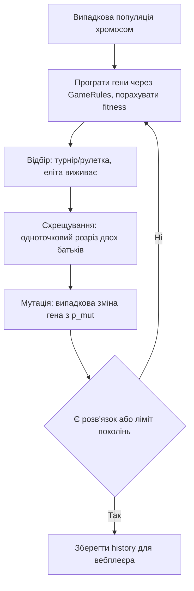

# Прототип 3 Візуалізація GA (Genetic Algorithm) у вебі

## Статус і призначення

Це пропозиція візуального прототипу еволюційного алгоритму для Sokoban у вебклієнті. Призначений для наочної демонстрації еволюції популяції розв'язків: як випадкові ланцюжки ходів через схрещування, мутацію та відбір перетворюються на робочий маршрут.

Головна ідея: послідовність ходів (або макро-команд штовхання) кодується як «хромосома» (ланцюжок генів-напрямків). Створюється популяція таких ланцюжків. Оператори схрещування (об'єднання частин двох розв'язків), мутації (випадкова зміна ходу) та відбору (виживання хромосом з найкращою евристикою) еволюціонують популяцію до розв'язку.

Обрано саме GA серед GA та GP, тому що:
- GA дає трек на карті (хромосома = шлях, який можна програти як у прототипі 2);
- GP еволюціонує дерево правил поведінки, а не конкретний шлях — його не показати на карті, лише абстрактні дерева;
- GA має видовищну генетику: кольорові смужки хромосом, анімація розрізу при кросовері, спалах мутації, родовід віннера.

## Дані з наявної програми

Повторно сканувати поле не потрібно. Після завантаження рівня використовуються структури програми:

```cpp
initial.player;       // позиція гравця
initial.boxes;        // позиції всіх ящиків
board.goals();        // позиції всіх цілей
board;                // стіни для перевірки ходів
```

Для прототипу додатково зберігається лише історія популяції:

```ts
type Chromo = { id: number; gen: number; genes: Dir[]; fitness: number; parents: [number, number] | null };
// history[gen] = Chromo[] — гени + батьки для родоводу, без кадрів canvas
```

Валідація маршруту — як у прототипах 1–2: результат перевіряється через `ReplayValidator` або послідовні виклики `GameRules::tryMove()` перед відтворенням.

## Загальна схема



Fitness (менше — краще):

```text
fitness = pushes * wP + moves * wM + distToGoals * wD + deadlockPenalty
```

## Режими вебплеєра

1. **Смужки хромосом.** Популяція покоління — список кольорових смужок (ген = стрілка `↑←↓→`). Клік по хромосомі — деталі: fitness, батьки, кнопки `програти на карті` / `vs winner`.
2. **Кросовер.** Вибір двох батьків або авто-показ акту створення дитини: дві смужки зверху, лінія розрізу, дитина знизу (перша половина від A, друга від B). Мутація — червоний спалах на зміненому гені.
3. **Родовід віннера.** Дерево `дитина → батьки → діди` до покоління 0. Клік по вузлу — його смужка + його шлях на карті. Показує, з яких двох половинок зібрався виграшний маршрут.
4. **Покоління на карті.** Як у прототипі 2: глобальний крок `t`, усі хромосоми покоління рухаються одночасно, toggle слідів. Плюс два мініграфіки: best/avg fitness та різноманітність популяції.

Загальні контроли: вибір покоління `1..G`, play, швидкість, фільтр `тільки еліта / всі`, порівняння `вибрана vs winner`.

## Примітивний псевдокод

```text
pop = випадкові хромосоми довжини L
history = []

для gen в 1..G:
    для кожної хромосоми:
        fitness = програти гени через правила + евристика
    history.додати(pop з fitness та parents)
    якщо є хромосома-розв'язок: зупинитись, best = вона

    elite = k кращих без змін
    діти = []
    поки дітей < N - k:
        A, B = турнірний відбір(pop)
        cut = випадкова точка розрізу
        child = A[0:cut] + B[cut:]
        з імовірністю p_mut змінити випадковий ген
        діти.додати(child з parents = [A.id, B.id])
    pop = elite + діти

повернути history + best
```

## Приблизний каркас для програми

```cpp
std::vector<Chromosome> pop = randomPopulation(popSize, chromoLen);
std::optional<Chromosome> best;

for (int gen = 0; gen < maxGen; ++gen) {
    evaluate(board, initial, pop); // fitness через GameRules + dist + deadlock
    saveHistory(gen, pop);
    if (auto cur = findSolution(pop)) {
        best = validateThroughGameRules(initial, *cur) ? cur : best;
        break;
    }
    pop = nextGeneration(pop, eliteK, mutProb); // відбір + кросовер + мутація
}
```

`evaluate` грає гени тільки допустимими ходами (стіни, межі, ящики — через правила гри); недопустимий ген пропускається з малим штрафом. `saveHistory` зберігає гени + `parents` для родоводу у `web/src` (Canvas 2D, без three.js).

## Частота сканування поля

Парсер сканує поле один раз при завантаженні рівня. Під час еволюції позиції беруться з `GameState`. Оцінка покоління — `O(N * L)` програвань ходів. Вебплеєр не перераховує еволюцію, а лише відтворює збережений `history`, тому скрабер і play працюють за `O(видимі хромосоми)` на кадр.

## Лімітації прототипу 3

1. **Не є повноцінним solver.** GA не гарантує оптимальності та повноти; це демонстраційна еволюція для порівняння з BFS, A* і прототипами 1–2.
2. **Фіксована довжина хромосоми.** Замала `L` — не дістане до цілі; завелика — сміттєві хвости; потрібен підбір або макро-гени штовхань.
3. **Штрафна fitness крихка.** Погані ваги `wP/wM/wD` женуть популяцію в локальний мінімум (штовхання в кут біля цілі).
4. **Deadlock без детектора.** Без штрафу за заморожені ящики популяція «полюбить» короткі тупикові шляхи.
5. **Багатоящикові рівні складні.** Для старту — один ящик або малі рівні.
6. **Пам'ять історії.** `history` росте як `G * N * L`; для довгих хромосом зберігати проріджено (еліта + предки віннера + семпл).
7. **Маршрут не є дозволом на рух.** Перед показом як «розв'язок» — обов'язкова перевірка через правила гри.

## Умови, за яких прототип працює

Прототип доцільний, якщо:

- потрібна саме видовищна генетика (смужки, кросовер, мутації, родовід віннера);
- достатньо малих/середніх рівнів для швидкої оцінки популяції;
- вебклієнт (`web/src`, Canvas 2D) використовується лише як плеєр збереженого `history`, а не рахує еволюцію в реальному часі;
- результат порівнюється з baseline (прототип 1, прототип 2, BFS, A*) за довжиною маршруту і динамікою fitness, а не заявляється як оптимальний solver.
