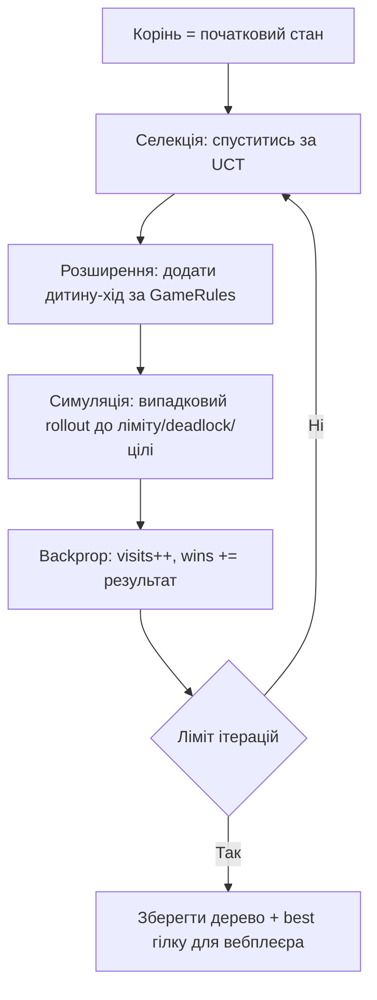

# Прототип 5 Візуалізація MCTS (Monte Carlo Tree Search) у вебі

## Статус і призначення

Це пропозиція візуального прототипу AI-пошуку для Sokoban у вебклієнті. Призначений для наочної демонстрації дерева пошуку: як тисячі швидких випадкових симуляцій (rollouts) виявляють найперспективнішу гілку без повного прорахунку.

Головна ідея (як в AlphaGo): замість точного розбору кожної гілки робимо цикли `селекція → розширення → симуляція → зворотне поширення`. Вузол з кращим UCT-рахунком (баланс експлуатації/дослідження) отримує більше візитів. Перемагає гілка з кращим winrate.

Обрано серед DQN / PPO / HRL / Curriculum / Neuro-Symbolic, тому що:
- MCTS не потребує тренування нейромережі — працює одразу на рівні через `GameRules`;
- дерево росте наочно: товщина гілки = visits, колір = winrate;
- DQN/PPO/HRL/Curriculum/Neuro-Symbolic потребують навчання, датасетів і бекенда — не для Canvas-демо.

## Дані з наявної програми

Повторно сканувати поле не потрібно. Після завантаження рівня використовуються структури програми:

```cpp
initial.player;       // позиція гравця
initial.boxes;        // позиції всіх ящиків
board.goals();        // позиції всіх цілей
board;                // стіни для перевірки ходів
```

Для прототипу зберігається дерево:

```ts
type MCTSNode = { id: number; parent: number | null; visits: number; wins: number; move: Dir };
// + порядок створення id для перемотки росту дерева
```

Валідація маршруту — як у прототипах 1–4: найкраща гілка перевіряється через `ReplayValidator` або послідовні виклики `GameRules::tryMove()` перед відтворенням.

## Загальна схема



UCT:

```text
uct = winrate + C * sqrt(ln(parentVisits) / visits)
```

## Режими вебплеєра

1. **Ріст дерева.** Скрабер по `id`: дерево малюється по кроках створення — видно як рій симуляцій спочатку розпорошується, потім густішає на переможній гілці. Товщина ребра = `visits`, колір = `winrate`.
2. **Карта + дерево синхронно.** Клік по вузлу — шлях `корінь → вузол` програється на карті. Клік по клітинці карти — підсвітка вузлів що через неї проходили.
3. **Rollout-спалахи.** Останні N симуляцій — тонкі напівпрозорі лінії поверх дерева, що гаснуть. Показує «тисячі швидких спроб» без захаращення екрану.
4. **Best гілка.** Кнопка `показати best`: шлях з кращим winrate золотим поверх дерева + play на карті. Порівняння `вибрана гілка vs best`.

Загальні контроли: play росту, швидкість, фільтр `visits > K` (обрізати шум), ліміт показаних rollout-ів.

## Примітивний псевдокод

```text
root = вузол(initial)
для iter в 1..N:
    node = root
    поки node має дітей і всі розкриті:
        node = дитина з max UCT
    якщо node не термінальний і має нерозкриті ходи:
        node = розкрити одну дитину (хід за GameRules)
    result = випадковий rollout від node (ліміт L кроків)
    поки node != null:
        node.visits++
        node.wins += result (1 = ближче до цілі/ціль, 0 = тупик)
        node = node.parent

best = гілка з кращим winrate при visits > порога
```

## Приблизний каркас для програми

```cpp
MCTSNode root{initial};
for (int i = 0; i < iters; ++i) {
    MCTSNode* node = &root;
    while (node->fullyExpanded() && !node->isTerminal(board)) {
        node = node->bestUCTChild(C);
    }
    if (!node->isTerminal(board) && node->hasUntried(board)) {
        node = node->expand(board); // один хід за GameRules
    }
    double result = rollout(board, node->state, rolloutLen); // 0..1
    node->backprop(result);
}
// дерево -> history для web/src (Canvas 2D), best гілку валідувати через GameRules
```

`expand` і `rollout` використовують тільки допустимі ходи (стіни, межі, ящики — через правила гри). `rollout` зупиняється на цілі / deadlock / ліміті кроків.

## Частота сканування поля

Парсер сканує поле один раз при завантаженні рівня. Під час пошуку позиції беруться з `GameState`. Ітерація — `O(глибина + rolloutLen)`. Вебплеєр лише малює збережене дерево (зріз за `visits > K`), тому перемотка працює за `O(видимі вузли)` на кадр.

## Лімітації прототипу 5

1. **Не є повноцінним solver.** MCTS не гарантує оптимальності; це демонстрація балансу дослідження/експлуатації.
2. **Rollout шумний.** Випадкові симуляції на Sokoban часто впираються в deadlock; потрібна евристична (не чисто випадкова) політика rollout.
3. **Вибух дерева.** Без ліміту дітей і обрізання за `visits` дерево на багатоящикових рівнях стане нечитабельним.
4. **UCT-константа.** Погана `C` = або сліпа жадібність, або вічне блукання; потрібен підбір.
5. **Для старту — малі рівні.** Повні рівні з кількома ящиками — лише з макро-ходами штовхань, інакше глибина захлинеться.
6. **Маршрут не є дозволом на рух.** Перед показом як «розв'язок» — обов'язкова перевірка через правила гри.

## Умови, за яких прототип працює

Прототип доцільний, якщо:

- потрібна саме картина «дерево виросло і зійшлося» (товщина = visits, колір = winrate, перемотка росту);
- достатньо малих/середніх рівнів для тисяч швидких rollout-ів;
- вебклієнт (`web/src`, Canvas 2D) лише малює збережене дерево, а не рахує MCTS у реальному часі;
- результат порівнюється з baseline (прототип 1, BFS, A*) за visits/winrate best-гілки, а не заявляється як оптимальний solver.
