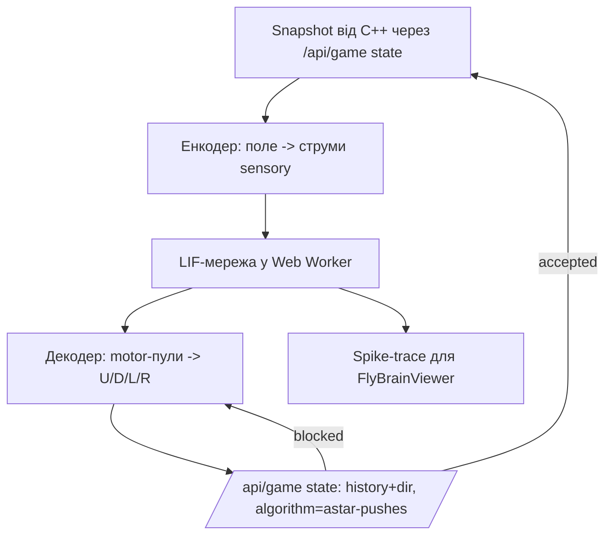

# Прототип 8 · FlyBrain — скопійований мозок мухи як web-only біо-агент

## 1. Статус і призначення

Це пропозиція **web-only** демонстраційного солвера для Sokoban: спрощена симуляція мозку дрозофіли (LIF-мережа за мотивами FlyWire-коннектому) в закритому контурі намагається пройти рівень.

Головна ідея як у DishBrain (культура нейронів грає в Pong): стан поля кодується в стимуляцію сенсорних нейронів, спайки декодуються в `U/D/L/R`, хід перевіряється C++ ядром, нове поле знову подається в мозок.

Призначення — навчальне: показати різницю між точним пошуком (BFS/A*) і біо-наївним агентом, дати живу візуалізацію спайків + аналітику. **Не заявляти як оптимальний solver.**

Тільки для web (`web/`). CLI (`src/`, `sokoban_cli.exe`) і C++ ядро **не чіпати**.

## 2. Що це НЕ є (чесність перед користувачем)

- Це НЕ повний коннектом 139 255 нейронів / 50М синапсів. Це резервуар 1500–3000 LIF-нейронів, топологічно схожий (sensory → central → motor).
- Це НЕ жива муха і НЕ MEA-залізо. Жодних електродів, тільки TypeScript-симуляція.
- НЕ гарантує рішення. Муха еволюційно вміє навігацію/фототаксис, а не штовхання ящиків з дедлоками. На складних рівнях вона зациклиться — це очікувано і показується в UI як `LimitReached`-подібний результат.
- Підпис в UI обов'язковий: `Біо-агент · не гарантує рішення · ліміт N кроків`.

## 3. Науковий базис (для опису в UI/курсовій, 4 факти)

1. FlyWire, `Nature` 02.10.2024: повний коннектом дорослої Drosophila — 139 255 нейронів, ~50М синапсів. Дані: `flywire.ai`, `codex.flywire.ai`.
2. Shiu et al., `Nature` 2024: LIF-модель всього мозку мухи запускається на ноутбуці і >90% передбачає сенсомоторні реакції.
3. Kagan et al., `Neuron` 2022 (DishBrain): ~800к нейронів на MEA навчились Pong за 5 хв у закритому контурі. Звідси береться архітектура `сенсорика → мозок → моторика → середовище → сенсорика`.
4. Eon Systems, 03.2026: емуляція ~125к нейронів + тіло `NeuroMechFly v2 + MuJoCo` рухається без коду ходьби. Доводить, що коннектом → поведінка без RL-нагороди можливий.

## 4. Архітектура



Ключове правило проєкту (див. `docs/AGENTS.md`, `docs/19_WEB_BRIDGE_AND_API.md`): **C++ ядро — єдиний арбітр правил.** Мозок лише пропонує напрямок, `accepted/blocked` вирішує сервер. Локальний `replayState` (як у `EvolutionViewer.tsx:15`) дозволений тільки для малювання сліду, не для валідації фінального маршруту.

Виконання: симуляція в Web Worker (не блокувати `BoardView`), візуалізація — Canvas 2D (без three.js, як вимагає прототип 2), React тільки для контролів.

## 5. Дані з наявної програми (перевикористати)

- `Snapshot { board, state, moves, pushes, won, accepted }` — з `web/src/lib/types.ts:63-81`. Поле сканується парсером один раз, прототип бере позиції з `state`.
- `request<Snapshot>(history, "state", dir, "astar-pushes")` з `Game.tsx:246` — єдиний спосіб зробити хід. Режим `"solve"` для flybrain **заборонений** (C++ його не знає).
- `BoardView`, `BoardMarker`, `BoardCellHint` — для показу поля і сліду маршруту.
- `EvolutionViewer.tsx` — взяти як шаблон плеєра: режими individual/generation, скрабер, play/pause, fitness-чарт. Не копіювати логіку гравітації/ДНК, тільки каркас.
- `SearchResult` + `Decision` + `sessionStorage` — для картки результату. Повні спайк-трейни в `sessionStorage` **не писати** (ліміт), тільки саммарі (див. §7).

## 6. Файли: створити / змінити

| Дія | Файл | Зміст |
|---|---|---|
| Створити | `web/src/lib/flybrain.ts` | LIF-мережа + енкодер/декодер, чисті функції без React. Експорт `createFlyBrain(seed)`, `stepBrain(brain, currents): { spikes }`, `encodeState(snapshot, history): Float32Array`, `decodeAction(motorSpikes): Dir` |
| Створити | `web/src/workers/flybrain.worker.ts` | Цикл closed-loop: отримує `snapshot+base`, ганяє кроки, постить `trace`-події назад. Весь `setTimeout`/крок тут, не в UI |
| Створити | `web/src/components/FlyBrainViewer.tsx` | Canvas-растр спайків + міні-поле + аналітика. Props як у `EvolutionViewer`: `{ result, loadSnapshot }` |
| Змінити | `web/src/lib/types.ts` | `Algorithm = LocalAlgorithm \| "gemini" \| "flybrain"`, **НЕ** додавати в `LOCAL_ALGORITHMS` (щоб `/api/game` відхиляв solve, а `compare` його не чіпав). Додати в `ALGORITHMS` запис `{ id: "flybrain", label: "FlyBrain · муха", metric: "Біо-агент · web only" }`. Додати `flybrain?: FlyBrainHistory` в `SearchResult` + інтерфейси з §7 |
| Змінити | `web/src/components/Game.tsx` | У `solve()`: гілка `if (algo === "flybrain") → runFlyBrain(base)` замість `request(..., "solve")`. У картці рішення: `<details><summary>Спостерігати за мозком</summary><FlyBrainViewer/></details>` за зразком `evolution-observer` (`Game.tsx:1144`). У `restoreDecision`: пропустити поле `flybrain` через той самий фільтр чисел, що й `trace`, і обрізати довжину |
| Змінити | `web/src/app/api/game/route.ts` | Нічого не міняти. Перевірити, що `LOCAL_ALGORITHMS` не містить flybrain, отже `solve+flybrain` повертає 400 — це захист, а не баг |
| Додати | `web/tests/flybrain.test.mjs` | 3 unit-тести: енкодер детермінований, декодер обирає мажоритарний пул, LIF без струму не спайкує |

## 7. Модель даних

```ts
export interface FlyBrainSpikeFrame {
  t: number;            // номер кроку мозку (0..steps)
  dir: Dir;             // обраний напрямок на цьому кроці
  accepted: boolean;    // що відповів C++ арбітр
  sensory: number;      // сумарні спайки sensory-групи
  central: number;      // сумарні спайки central-групи
  motor: [number, number, number, number]; // спайки пулів U/D/L/R
  won: boolean;
}
export interface FlyBrainHistory {
  kind: "flybrain";
  neurons: number;      // напр. 2200
  steps: number;        // скільки кроків реально зроблено (cap 300)
  frames: FlyBrainSpikeFrame[]; // cap 300, тільки числа, без canvas-кадрів
  spikeRate: number;    // середні спайки/крок/1000 нейронів
  loops: number;        // скільки разів детектовано цикл позицій
  seed: number;
}
```

`SearchResult` для flybrain: `moves` — прийняті C++ ходи (може бути порожнім), `pushes/explored/generated/deadlocks/frontier` — як звичайно (`explored = steps`, `generated = запропоновані напрямки`, `deadlocks = заблоковані C++ ходи`), `validated: true` тільки після фінального прогону `base+moves` через `state`-режим, `trace: []` (щоб не ламати `SearchDebugger`), `flybrain: FlyBrainHistory`.

## 8. LIF-симуляція (дефолт, щоб інший агент не вигадував)

- Розмір: `sensory 64 + central 1800 + motor 4×40 = 2004` нейрони. Cap пам'яті: ваги `Float32Array`, розріджена зв'язність 2–5%.
- Нейрон: `v += dt*(-(v-vRest)/tau + I)`, `dt=1мс, tau=20мс, vRest=-70мВ, threshold=-50мВ, reset=-65мВ, refractory=2мс`. Шум: `I += randn*0.5`.
- Зв'язки: `sensory→central` топографічно (сусідні сенсори → сусідні центральні), `central→central` рекурентні випадкові, `central→motor` випадкові. Ваги uniform `0.2..0.8`, 20% гальмівні (`-`). Seed через mulberry32, seed зберігати в history для відтворюваності.
- **Енкодер** `encodeState`: взяти вікно 5×5 навколо гравця (стіна/підлога/ящик/ціль/гравець+ціль = 5 каналів → 25×5=125 ознак, стиснути до 64 струмів усередненням). Додати вектор до найближчої цілі (мангеттен, 4 напрямки) як bias на sensory. Нормалізувати струми в `[0, 1.5]`.
- **Декодер** `decodeAction`: вікно 8мс, перемагає motor-пул з max спайків. Tie-break: порядок `U,D,L,R` + детермінований rand(seed+t). Якщо всі пули мовчать — випадковий допустимий хід (щоб не зависнути).
- Причина саме так: 5×5 вікно дешевше за все поле (`O(25)` на крок), LIF дешевший за HH, 2000 нейронів тримають 60fps у воркері, повний FlyWire для цього UI не потрібен (див. правило ponytail у репо — найменший робочий диф).

## 9. Closed-loop псевдокод (виконується у воркері)

```text
brain = createFlyBrain(seed)
history = base
frames = []
seen = порожня мапа stateKey -> крок
для t в 1..MAX_STEPS (300):
    snapshot = await getState(history)   # /api/game state, astar-pushes
    якщо snapshot.won: break
    currents = encodeState(snapshot, history)
    spikes = stepBrain(brain, currents, 8мс)
    dir = decodeAction(spikes.motor)
    next = await getState(history + dir) # C++ арбітр
    accepted = next.accepted
    frames.push({t, dir, accepted, sensory, central, motor, won: next.won})
    якщо accepted:
        history += dir
        key = stateKey(next.state)
        якщо key вже в seen: loops++, додати шум-bias в brain (уникнути вічного циклу)
        seen[key] = t
    інакше:
        послабити ваги central->motor для dir на 5% (одноразово, без навчання ваг ядра)
    постити progress у UI кожні 5 кроків
повернути { moves: history.slice(base.length), frames, ... }
```

`stateKey = player + ":" + sorted(boxes).join(",")`. `MAX_STEPS=300`, `MAX_WALL_MS=20000` — після цього статус `LimitReached` (не `Solved`), маршрут все одно показати.

## 10. Валідація через C++ (обов'язково, без винятків)

1. Кожен крок уже валідований, бо пройшов через `state`-режим.
2. Фінальний маршрут перед `Застосувати`: один запит `state` для `base + moves` цілком. Якщо `!accepted` або `moves` містить не-`UDLR` — `InternalError`, кнопку блокувати.
3. Заборонено вважати `moves` з декодера розв'язком без п.2 (аналог лімітації 13 з прототипу 1).

## 11. Вебплеєр `FlyBrainViewer.tsx`

Режими (мінімум, без роздування):
1. **Живий растр:** Canvas, вісь X — час (кроки), Y — 120 семплованих нейронів (40 з кожної групи, підписати смуги Sensory/Central/Motor). Спайк = крапка. Автоскрол, пауза при `prefers-reduced-motion`.
2. **Мозок → дія:** під растром смуга `↑←↓→` з підсвіткою поточного `dir`, червоним — `blocked` C++.
3. **Міні-поле:** `BoardView` з маркером сліду (перевикористати `routeMarkers` з `EvolutionViewer:157`).

Контроли: Play/Pause, крок ±1, скрабер `t`, швидкість (як у `EvolutionViewer:446`), toggle `сліди on/off`, кнопка `показати переможний префікс` (обрізати frames до першого `won`, якщо є).

Бюджет: один `requestAnimationFrame`, даунсемпл хвоста >150 кроків, offscreen-шар для слідів (як у лімітації 6 прототипу 2). Великі поля (>22) — як у `Game.tsx:647`: тільки міні-поле без камери.

## 12. Аналітика (що показати під плеєром)

- Біо: `spike rate`, стовпчики активності Sensory/Central/U/D/L/R, ентропія вибору напрямків (4 числа + одне H).
- Ігрова: ходи/штовхання (з `SearchResult`), % ящиків на цілях over time (міні-лінія, рахувати з `loadSnapshot` кадрів кожні 10 кроків, не частіше), `loops`, `blocked` count.
- Порівняння: один рядок `A* pushes vs FlyBrain pushes` — щоб було видно, що муха гірша, і це нормально.

## 13. Ліміти і захист

- `MAX_STEPS 300`, `MAX_FRAMES 300`, семпл нейронів для UI 120, `sessionStorage`: зберігати тільки `moves + саммарі + frames` (числа), обрізати при `>50КБ` — дропнути `frames`, лишити саммарі (плеєр покаже `історія спайків не збережена`).
- Воркер обов'язково: симуляція не в головному потоці. Abort через `AbortController` як у `Game.tsx:300` (`cancelSearch` зупиняє і воркер).
- A11y: canvas має `role=img` + `aria-label` з поточним кроком і дією; кнопки з `aria-label`; `prefers-reduced-motion` вимикає autoplay.
- Рівні: рекомендувати малі (`01_simple`, custom 1 ящик). На великих показати попередження `муха тут страждатиме`.

## 14. Тести і команди перевірки

```powershell
cd web
npm run typecheck
npm run test:native
node --test tests/flybrain.test.mjs
npx playwright test --grep flybrain
```

Очікувано: typecheck чистий, 3 unit-тести зелені, e2e `обрати FlyBrain → дочекатись перших 10 frames → крок→ / пауза` без висяків. C++ тести не ганяти (ядро не чіпалось): `ctest --test-dir ../build` тільки якщо випадково зачепив `src/`.

## 15. Покроковий план для агента-виконавця

1. Прочитати `docs/PLAN.md`, `docs/ALGORITHMS.md`, `docs/AGENTS.md` + цей файл.
2. `types.ts`: додати `flybrain` за §6, прогнати `npm run typecheck`.
3. `lib/flybrain.ts`: LIF + енкодер/декодер за §8, детерміновані від seed. Покрити `tests/flybrain.test.mjs`.
4. `workers/flybrain.worker.ts`: цикл з §9, пости progress, обробка abort.
5. `Game.tsx`: гілка `flybrain` у `solve()`, картка з `FlyBrainViewer`, `restoreDecision` з обрізкою.
6. `FlyBrainViewer.tsx`: растр + смуга дій + міні-поле + аналітика з §11–12.
7. Прогнати §14, заскрінити малий рівень (вимога PR для UI-змін).
8. У фінальному звіті: файли, команди+результати, ліміти, хеш коміту. Не чіпати `src/`, `bindings/`, CLI.

## 16. Критерії приймання

- [ ] У дропдауні алгоритмів є `FlyBrain · муха`, тільки у web.
- [ ] Кнопка `Обчислити вибраний` запускає воркер, видно живий растр і поточну стрілку дії.
- [ ] Кожен показаний хід підтверджений C++ (`accepted`), фінальний маршрут проходить п.10.
- [ ] Є аналітика з §12 і чесний підпис про негарантованість.
- [ ] `compare` не ламається (flybrain туди не входить), `state`-режим працює як раніше.
- [ ] `sessionStorage` не переповнюється, abort зупиняє воркер, `typecheck` чистий.

## 17. Лімітації (відверто)

1. Не оптимальний і часто не розв'язує — це демо, не заміна A*.
2. Локальне вікно 5×5 не бачить далекі цілі і довгі обходи стін.
3. Декодер мажоритарний — схильний до дрижання (U-D-U-D) без детектора циклів.
4. Одноразове послаблення ваг — не навчання, пам'ять тільки на сесію.
5. 300 кроків × `state`-запити = повільніше за один `solve` C++; на великих рівнях гальма мережі, а не мозку.
6. Canvas-растр — семпл, а не всі 2000 нейронів; повна матриця 2000×300 малювалась би в лаги.

## 18. Умови, за яких прототип доречний

- Потрібна саме видовищна біо-демонстрація для курсової/захисту: живі спайки, що клікають, + чесна аналітика проти A*.
- Достатньо малих рівнів (1–2 ящики).
- Web-клієнт використовується як сцена: мозок у воркері, C++ як арбітр, Canvas тільки малює.
- Результат порівнюється з baseline за довжиною/штовханнями, а не заявляється як новий solver.
