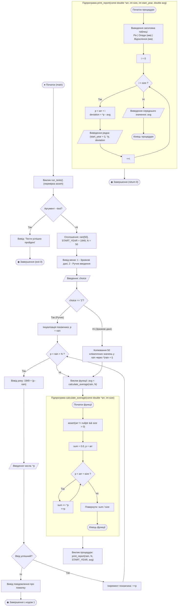
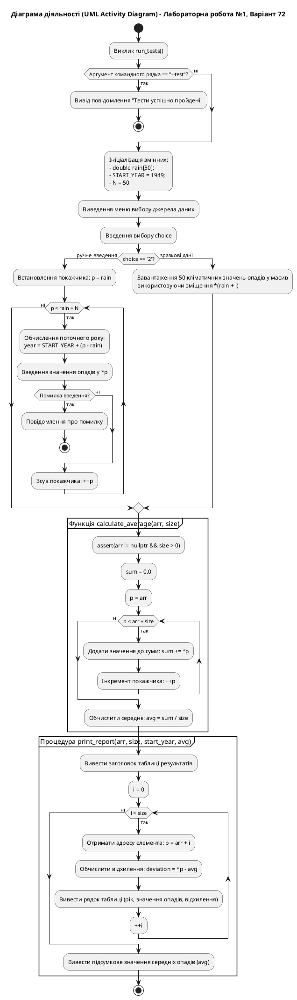

# Блок-схема алгоритму (UML Activity Diagram)

## Лабораторна робота №1. Варіант 72

**Тема:** Опрацювання одновимірних масивів з використанням покажчиків.  
**Задача:** Розрахунок середньої кількості опадів у Вінниці за 50 років (1949–1998) та річних відхилень від середнього.

---

## 1. UML Activity Diagram (Mermaid)

---

## 2. Специфікація діаграми за стандартом UML (PlantUML)

---

## 3. Таблиця відповідності елементів UML-схеми та конструкцій мови C++

| Елемент діаграми UML                                     | Конструкція у коді [`main.cpp`](file:///c:/Users/muaro/Documents/GitHub/Learning-assistent/ALG_AND_STR/Labs/LAB1/v2/main.cpp) | Призначення                                                                     |
| :------------------------------------------------------- | :---------------------------------------------------------------------------------------------------------------------------- | :------------------------------------------------------------------------------ |
| **Початковий / Кінцевий вузол** (`Initial / Final Node`) | `int main(...)` / `return 0;`                                                                                                 | Точка входу в програму та завершення роботи.                                    |
| **Дія (Action Node)**                                    | `sum += *p; ++p;`                                                                                                             | Обчислення значень за допомогою розіменування та арифметики покажчиків.         |
| **Розгалуження (Decision Node)**                         | `if (choice == '2') { ... } else { ... }`                                                                                     | Вибір режиму: ручне введення користувачем або типові дані Вінниці.              |
| **Цикл (Loop / Activity Partition)**                     | `for (const double *p = arr; p < arr + size; ++p)`                                                                            | Ітерація по масиву виключно через покажчики без індексації квадратними дужками. |
| **Вхід / Вихід (Input/Output)**                          | `std::cin >> *p;`, `std::cout << ...`                                                                                         | Зчитування та форматований вивід результатів таблиці.                           |
