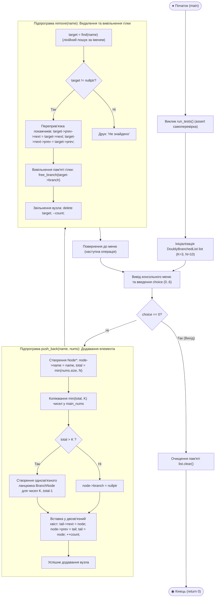
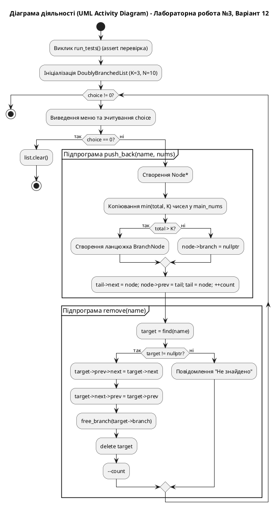

# Блок-схема алгоритму (UML Activity Diagram)

## Лабораторна робота №3. Варіант 12

**Тема:** Дослідження та реалізація базових динамічних структур даних: двозв‘язний список з розгалуженнями.  
**Задача:** Зберігання та операції над парами "Ім'я | Послідовність чисел (від 1 до $N$)". Для послідовностей довжиною понад $K$ організувати гілки ($K = 3$, $N = 10$).  
**Операції:** Додавання елементів, пошук і роздрукування, видалення, підрахунок кількості елементів, роздрукування всього списку.

---

## 1. UML Activity Diagram (Mermaid)

---

## 2. Специфікація діаграми за стандартом UML (PlantUML)

---

## 3. Таблиця відповідності елементів UML-схеми та конструкцій мови C++

| Елемент діаграми UML | Конструкція у коді [`main.cpp`](file:///C:/Github/Learning-assistent/ALG_AND_STR/Labs/LAB3/main.cpp) | Призначення |
| :--- | :--- | :--- |
| **Початковий / Кінцевий вузол** (`Initial / Final Node`) | `int main(...)` / `return 0;` | Точка входу в програму та коректне завершення. |
| **Блок автотестування** (`Action Node`) | `run_tests();` | Автоматична валідація інваріантів списку за допомогою `assert()`. |
| **Розгалуження (Decision Node)** | `if (total > K)` | Перевірка потреби у винесенні надлишкових чисел у гілку. |
| **Створення гілки (Branch Creation)** | `*b_tail = new BranchNode{nums[i], nullptr};` | Динамічне виділення та зв'язування елементів однозв'язної гілки. |
| **Вставка у двозв'язний хвіст** | `tail->next = node; node->prev = tail;` | Додавання нового елемента в кінець списку за $O(1)$. |
| **Пошук та перевірка (Lookup)** | `for (Node* curr = head; curr; curr = curr->next)` | Лінійне траверсування списку за покажчиками $O(n)$. |
| **Вилучення та очищення пам'яті** | `free_branch(target->branch); delete target;` | Безпечне вивільнення динамічної пам'яті без витоків (RAII). |
| **Консольна диспетчеризація** | `switch (choice) { ... }` | Інтерактивна взаємодія з користувачем через меню. |
