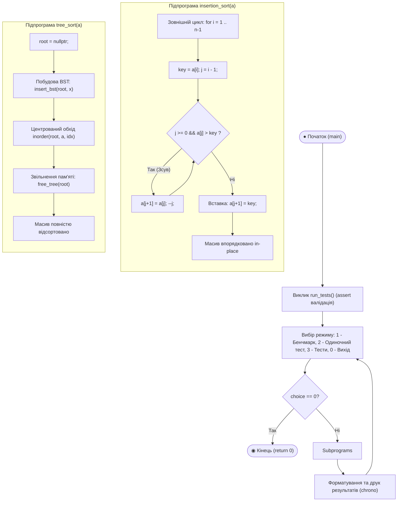
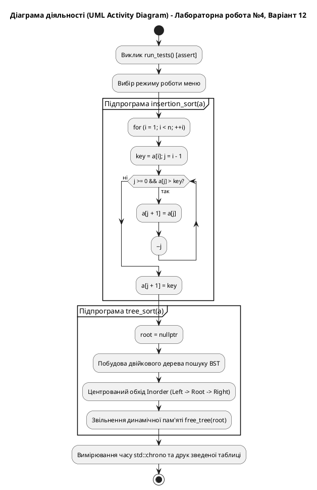

# Блок-схема алгоритму (UML Activity Diagram)

## Лабораторна робота №4. Варіант 12

**Тема:** Алгоритми сортування: сортування вставкою (Insertion sort) та сортування двійковим деревом (Tree sort).  
**Задача:** Порівняльний аналіз часу виконання двох алгоритмів сортування для різних розмірностей та розподілів даних.

---

## 1. UML Activity Diagram (Mermaid)

---

## 2. Специфікація діаграми за стандартом UML (PlantUML)

