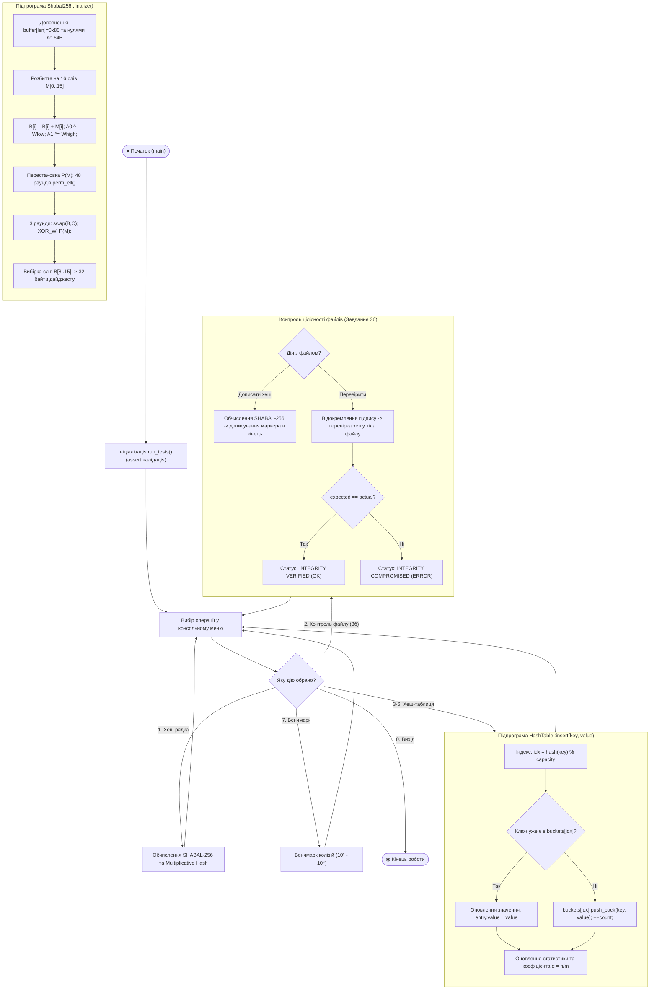
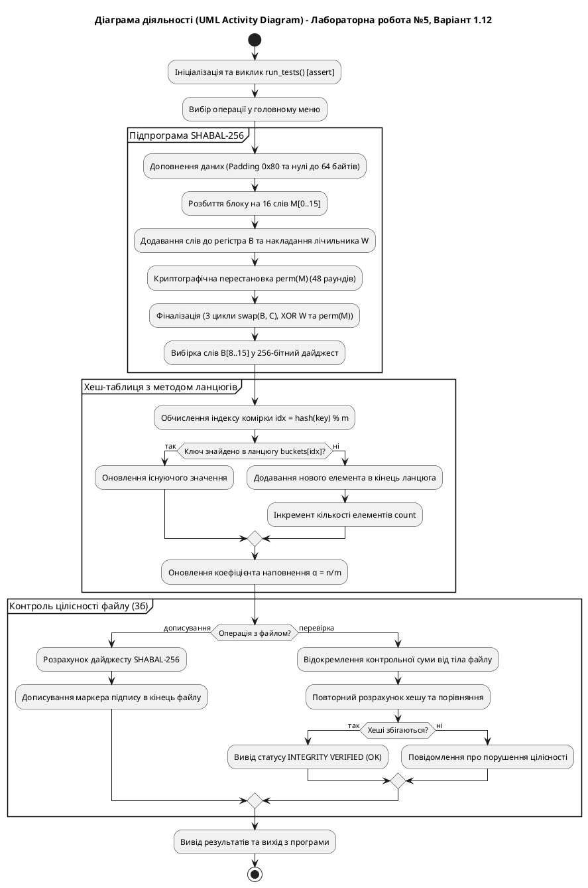

# Блок-схема алгоритму (UML Activity Diagram)

## Лабораторна робота №5. Варіант 1.12

**Тема:** Хеш-функції та хеш-таблиці (SHABAL-256, метод множення, контроль цілісності файлів, розв'язання колізій методом ланцюгів).  
**Задача:** Програмна реалізація хеш-функції SHABAL-256 (варіант 1.12), методу множення (парний варіант 12), верифікація цілісності файлів (завдання 3б) та експериментальний аналіз колізій.

---

## 1. UML Activity Diagram (Mermaid)

---

## 2. Специфікація діаграми за стандартом UML (PlantUML)

---

## 3. Таблиця відповідності елементів стандарту UML

| Елемент стандарту UML | Позначення на блок-схемі | Призначення в алгоритмі |
| :--- | :--- | :--- |
| **Initial Node** | Округлий блок (зелений) | Початок роботи функції `main()` |
| **Action State** | Прямокутник із заокругленими кутами | Операція обробки даних (доповнення, зсув, вставка) |
| **Decision Node** | Ромб (помаранчевий) | Перевірка умов (наявність ключа, валідація дайджесту) |
| **Merge Node** | Зведення ліній зі стрілками | Об'єднання результатів розгалуження |
| **Partition (Swimlane)** | Пунктирний контур із заголовком | Групування логіки підпрограм (SHABAL, таблиця, файл) |
| **Activity Final Node** | Округлий подвійний блок (червоний) | Успішне завершення роботи програми |
