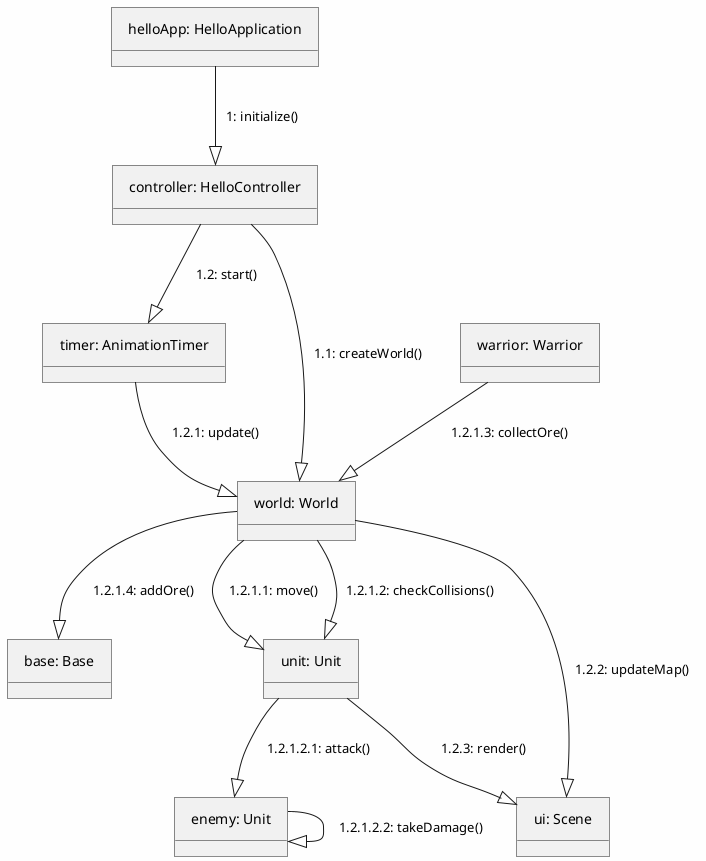

## 3.1 Діаграма наслідування

Наслідування — один із принципів об'єктно-орієнтованого програмування, який дозволяє описати новий клас на основі існуючого. У проекті Laba5 ієрархія класів реалізує загальну поведінку для всіх ігрових одиниць та будівель, виділяючи спільні поля й методи в базових класах `Unit` та `World`.

Нижче подано спрощену UML-діаграму наслідування (PlantUML) і короткий опис основних класів, їхніх полів та методів, узятих безпосередньо з реалізації у коді.

```plantuml
@startuml inheritance_laba5
skinparam classAttributeIconSize 0
class Unit {
    - Integer health
    - Boolean isSpawned
    - boolean team
    - Integer damage
    - Boolean isDead
    - ArrayList<String> inventor
    - double x, y
    - ImageView image, imageMark, imageMarkRed, imageMarkGreen
    - Line life
    + attack(), takeDamage(), move(dx,dy), moveTo(newX,newY), setPosition(x,y), resurrect(), setCoordinates(), inventoryLogic()
}

class Warrior {
    - double oreAmount
    - boolean collectingOre, deliveringOre
    + collect/deliver ore related methods
}

class Centurio {
    - double healNum
    - int killCount
    + heal(), getKillCount()
}

class Pretorio {
    - Circle areaOfEffect
    + healInArea(), logic()  // спеціальні можливості Pretorio
}

class World {
    - ArrayList<Unit> units
    - double health, maxHealth
    - ImageView imageView
    - Label labelName, numUnitsLabel
    + initGraphics(...), update(), worldLogic(), getUnits(), setOre()/getOre()
}

class Base {
    - ArrayList<Unit> unitsInside
    + getUnitsInside()
}

class Tower {
    - ArrayList<Unit> unitsInside
    - int healAmount
    + healUnits(), intersect()
}

Unit <|-- Warrior
Warrior <|-- Centurio
Centurio <|-- Pretorio
Unit <|-- (other concrete unit classes like Tower? see note)
World <|-- Base
World <|-- Tower
@enduml
```

Короткий опис класів (з посиланням на реалізацію):

- `Unit` (базовий класс для всіх істот)
    - Основні поля: `health`, `damage`, `team`, `isDead`, `isSpawned`, `inventor` (список предметів), позиції `x`,`y`, графічні примітиви (`image`, `life`, `labelName`, `rectActive` тощо).
    - Основні методи: `attack()`, `takeDamage()`, `move(dx,dy)`, `moveTo(newX,newY)`, `setPosition()`, `resurrect()`, `setCoordinates()`, `inventoryLogic()` та допоміжні сеттери/геттери. (див. `Unit.java`).

- `Warrior` extends `Unit`
    - Додає поля для роботи з ресурсами: `oreAmount`, `activeOre`, прапорці збору `collectingOre`, `deliveringOre`, таймаути збору.
    - Графічні лічильники (`oreCountLabel`) та логіка збору/доставки руди. (див. `Warrior.java`).

- `Centurio` extends `Warrior`
    - Додає лікування: `healNum`, `HEAL_COOLDOWN`, `lastHealTime` та лічильник `killCount` з наборами `countedKills` для коректного підрахунку вбивств; також перевизначає поведінку (див. `Centurio.java`).

- `Pretorio` extends `Centurio`
    - Розширює `Centurio` областю дії (`areaOfEffect`) і методом `healInArea()`; перевизначає графічні зміщення та логіку (`logic()`) (див. `Pretorio.java`).

- `World` (базовий клас для будівель і зон)
    - Поле `units: ArrayList<Unit>` — список одиниць, які належать або перебувають у зоні/будівлі.
    - Поля: `health`, `maxHealth`, `imageView`, `labelName`, `numUnitsLabel`, `oreAmount` та статичні лічильники для команд (`allyUnits`, `enemyUnits`).
    - Методи: `initGraphics(...)`, `resurrectWorld()`, `update()`, `worldLogic()`, `intersect()` (підлягає перевизначенню в підкласах) (див. `World.java`).

- `Base` extends `World`
    - Містить `unitsInside` (структура для зберігання юнітів у базі), завантаження контурних зображень, геттери для `getUnitsInside()` (див. `Base.java`).

- `Tower` extends `World`
    - Аналогічно до `Base`, але додає логіку лікування `healUnits()` та перевизначає `intersect()` для визначення юнітів у зоні вежі (див. `Tower.java`).

Примітка: у реалізації проєкту є й інші класи (наприклад, `Source`, `UnitCreationDialog`, `UnitInvetorWindow`), які не наслідують безпосередньо `Unit`/`World`, або виконують допоміжні функції UI/стоворення одиниць.

### Верифікація відповідності коду

Описані поля й методи взяті безпосередньо з джерельних файлів `Unit.java`, `Warrior.java`, `Centurio.java`, `Pretorio.java`, `World.java`, `Base.java`, `Tower.java`. Деякі поля — графічні (наприклад, `ImageView`, `Label`, `Line`) — використовуються для рендерингу в JavaFX і тому згадані як частина реалізації.

Якщо потрібно, я можу також згенерувати точні списки всіх публічних/захищених полів та методів для кожного класу (CSV/таблиця) — скажіть, чи треба.

# Діаграма кооперації Laba5

## 3.5 Діаграма кооперації

Кооперація (collaboration) - специфікація множини об'єктів, спільно взаємодіючих з метою реалізації окремих варіантів використання в загальному контексті модельованої системи.



## Опис взаємодій

| № | Метод | Опис |
|----|-------|------|
| 1: | `initialize()` | Ініціалізація додатку |
| 1.1: | `createWorld()` | Створення світу з одиницями |
| 1.2: | `start()` | Запуск анімаційного таймера |
| 1.2.1: | `update()` | Оновлення стану всіх одиниць |
| 1.2.1.1: | `move()` | Переміщення одиниці |
| 1.2.1.2: | `checkCollisions()` | Перевірка зіткнень |
| 1.2.1.2.1: | `attack()` | Атака ворога |
| 1.2.1.2.2: | `takeDamage()` | Отримання урону |
| 1.2.1.3: | `collectOre()` | Збір ресурсів |
| 1.2.1.4: | `addOre()` | Додання ресурсів до бази |
| 1.2.2: | `updateMap()` | Оновлення карти/UI |
| 1.2.3: | `render()` | Малювання одиниці |

## Послідовність викликів

```
JavaFX Event
    ↓
1: initialize()
    ↓
1.1: createWorld() ──→ 1.2: start() (Animation Loop)
                           ↓
                      1.2.1: update()
                           ↓
            ┌──────────────┼──────────────┐
            ↓              ↓              ↓
        1.2.1.1        1.2.1.2        1.2.1.3
        move()      checkCollisions() collectOre()
            ↓              ↓              ↓
                    attack() & takeDamage()
                           ↓
                      1.2.1.4: addOre()
                           ↓
                      1.2.2: updateMap()
```

## Як малювати таку діаграму вручну:

1. **Намалюйте прямокутники** для кожного об'єкта
2. **Позначте об'єкти**: `objectName: ClassName`
3. **Намалюйте стрілки** від объекту до об'єкта
4. **Нумеруйте методи**: `1:, 1.1:, 1.2:, 1.2.1:` тощо
5. **Додайте назву методу** біля стрілки

### Приклад

```
┌─────────────────────┐
│ app: HelloApp       │
└──────────┬──────────┘
           │ 1: start()
           ↓
┌─────────────────────┐      1.1: gameLoop() ───────→ ┌──────────────┐
│ timer: Timer        │◇─────────────────────────────│ world: World │
└─────────────────────┘                             └──────┬───────┘
                                                           │
                                    ┌──────────────────────┼───────────┐
                                    ↓                      ↓           ↓
                          ┌──────────────┐      ┌──────────────┐  ┌─────────┐
                    1.2.1: move()        │      │ attack()     │  │render() │
                          └──────────────┘      └──────────────┘  └─────────┘
```
